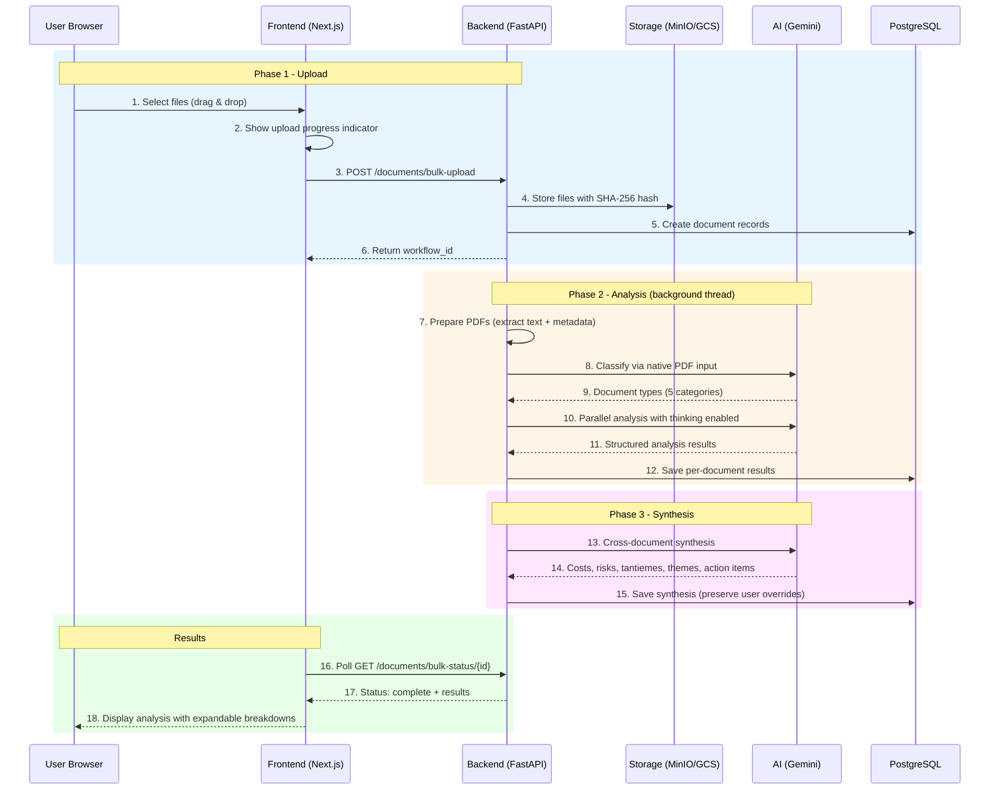
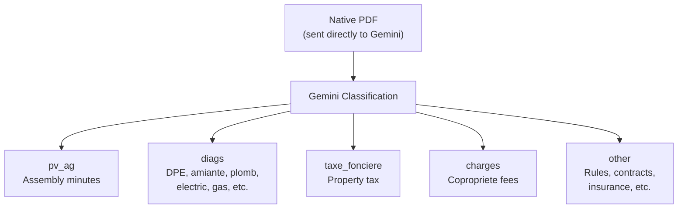
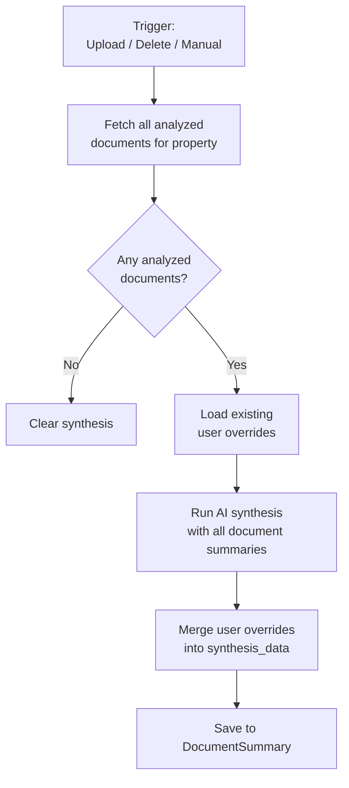
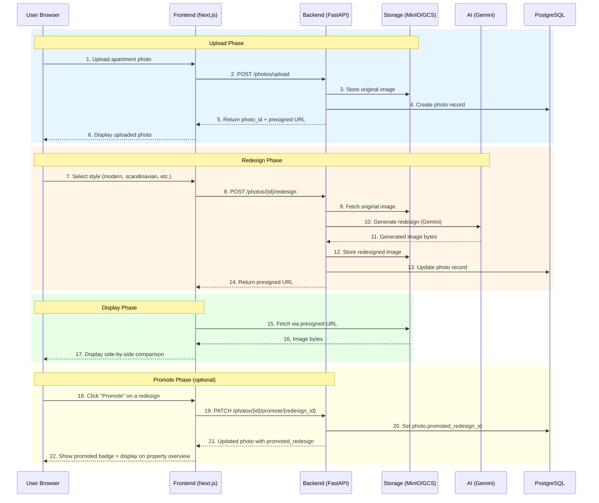

# Data Flow

This document describes how data flows through the AppArt Agent system for key operations.

## Document Upload and Analysis

The bulk document upload flow demonstrates the multi-phase async processing architecture. The frontend tracks three distinct phases: Upload, Analysis, and Synthesis.

### Processing Stages

```mermaid
flowchart LR
    subgraph Upload["1. Upload"]
        A["Files<br/>(PDF, Images)"]
        B["Multipart<br/>Form Data"]
    end

    subgraph Storage["2. Storage"]
        C["SHA-256<br/>Dedup Hash"]
        D["MinIO/GCS<br/>Object Store"]
    end

    subgraph Preparation["3. PDF Preparation"]
        E["Extract text<br/>(PyMuPDF)"]
        F["Gather metadata<br/>(pages, size)"]
    end

    subgraph Classification["4. Classification"]
        G["Native PDF<br/>to Gemini"]
        H["Document<br/>Category"]
    end

    subgraph Analysis["5. Analysis"]
        I["Type-specific<br/>Prompts + Thinking"]
        J["Parallel via<br/>asyncio.gather()"]
        K["Structured<br/>JSON Results"]
    end

    subgraph Synthesis["6. Synthesis"]
        L["Cost Breakdown<br/>(annual + one-time)"]
        M["Tantiemes<br/>Calculation"]
        N["Cross-doc Themes<br/>+ Action Items"]
        O["Risk Assessment<br/>+ Confidence Score"]
    end

    A --> B --> C --> D
    D --> E --> F
    F --> G --> H
    H --> I --> J --> K
    K --> L --> M --> N --> O
```

### Document Type Detection

Documents are classified into 5 categories using native PDF input to Gemini:

### Synthesis Regeneration

Synthesis is automatically regenerated when documents are added or removed. It can also be manually triggered. User overrides (tantiemes, cost adjustments) are preserved across regenerations.

## Price Analysis Flow

### DVF Query Pipeline

### Analysis Types

| Type | Data Source | Purpose | Cache TTL |
|------|-------------|---------|-----------|
| **Simple** | Exact address matches | Historical sales at property | 1 hour |
| **Trend** | Neighboring properties | Price evolution over time | 1 hour |
| **Market** | Area-wide data | Comparative market analysis | 1 hour |
| **Projection** | Trend + Market | Estimated future price | 1 hour |

## Photo Redesign Flow

### Redesign Styles

## Authentication Flow (Better Auth)

Authentication is handled by [Better Auth](https://www.better-auth.com/) on the frontend via Next.js API routes. The backend validates sessions by checking the `better-auth.session_token` cookie against the `ba_session` database table.

### Session Cookie Structure

The backend extracts only the token part (before the `.`) and looks it up in the `ba_session` table. Sessions expire after 7 days.

## DVF Data Import Flow

### DVF Data Pipeline

## Data Consistency

### Transaction Boundaries

### Caching Strategy

| Data Type | Cache Location | TTL | Invalidation |
|-----------|---------------|-----|--------------|
| User sessions | Redis | 7 days | On logout |
| DVF queries | Redis | 1 hour | Time-based |
| Document metadata | PostgreSQL | N/A | On update |
| File content | MinIO/GCS | N/A | Manual delete |
| AI analysis results | PostgreSQL | N/A | On re-analysis |

## Error Handling Flow

## Real-time Updates (Future)

