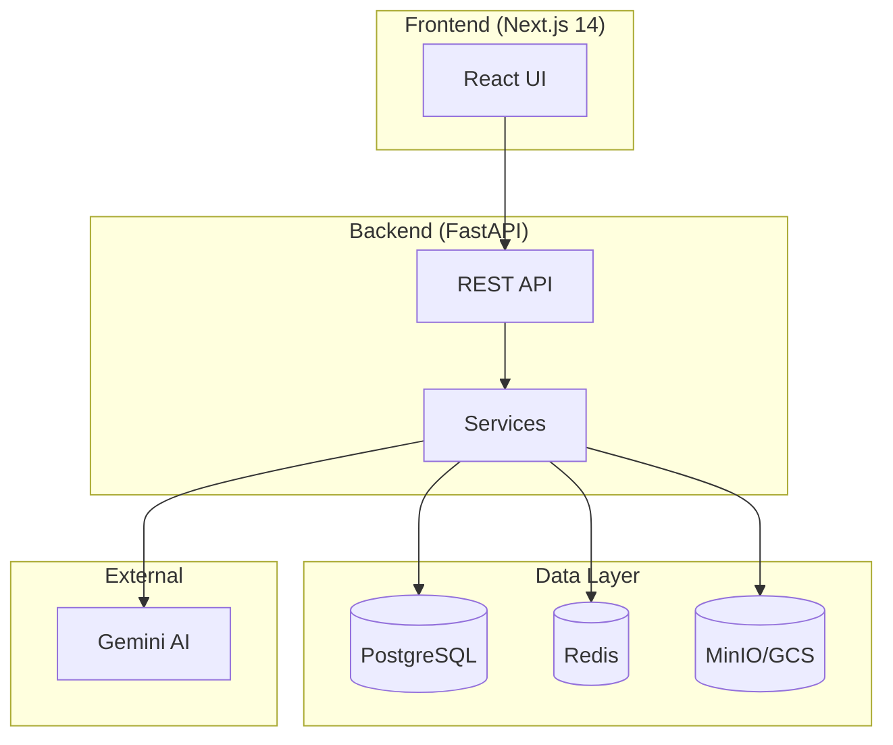
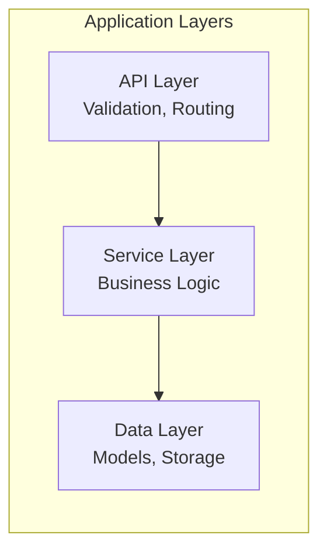
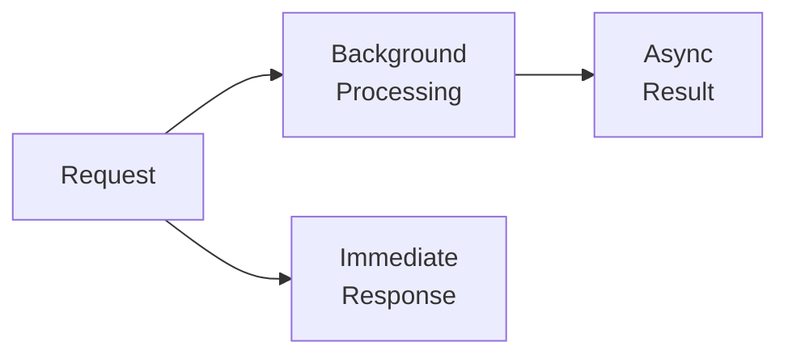
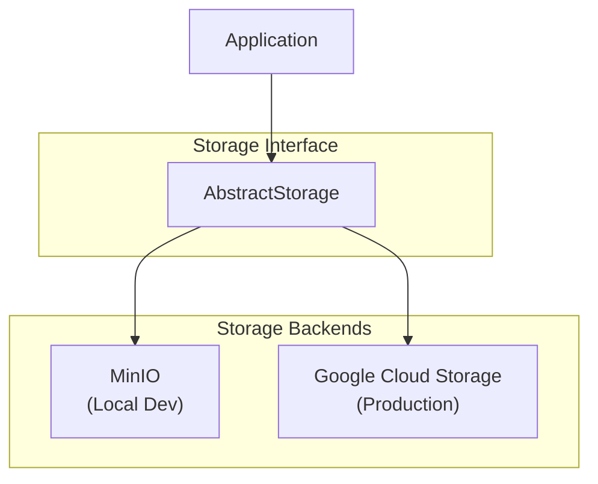
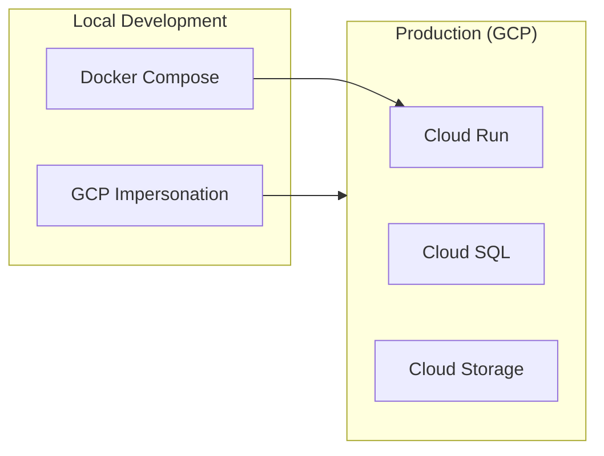

# Architecture

This section covers the system design and architecture of AppArt Agent.

## Overview

AppArt Agent follows a modern microservices architecture with clear separation of concerns:

| Layer | Technology | Purpose |
|-------|------------|---------|
| **Frontend** | Next.js 14 | React app with App Router |
| **Backend** | FastAPI | Async REST API |
| **Database** | PostgreSQL 15 | Primary data store (5.4M+ DVF records) |
| **Cache** | Redis 7 | Sessions and query caching |
| **Storage** | MinIO / GCS | Documents and photos |
| **AI** | Google Gemini | Document analysis, image generation |

## Sections

| Guide | Description |
|-------|-------------|
| [System Overview](overview.md) | High-level architecture, components, and security |
| [Data Flow](data-flow.md) | How data moves through the system for key operations |

## Design Principles

### 1. Separation of Concerns

Each layer has a specific responsibility:

- **API Layer**: Request handling, validation, routing
- **Service Layer**: Business logic, AI orchestration
- **Data Layer**: Database models, storage operations

### 2. Async-First Processing

Background processing for:

- Document analysis (native PDF classification + extraction with thinking)
- Bulk uploads with multi-phase tracking (upload, analysis, synthesis)
- Cross-document synthesis with cost breakdowns and tantiemes
- Image generation (photo redesigns)
- Automatic synthesis regeneration on document changes

### 3. Multi-Backend Storage

Abstracted storage interface supporting:

- **MinIO** for local development (S3-compatible)
- **Google Cloud Storage** for production (managed)

### 4. Environment Parity

Two modes for local development:

- **Docker Compose**: Full stack with MinIO
- **GCP Impersonation**: Real GCS/Vertex AI with local code

## Quick Links

- [System Overview →](overview.md)
- [Data Flow →](data-flow.md)
- [Deployment Options →](../deployment/index.md)
