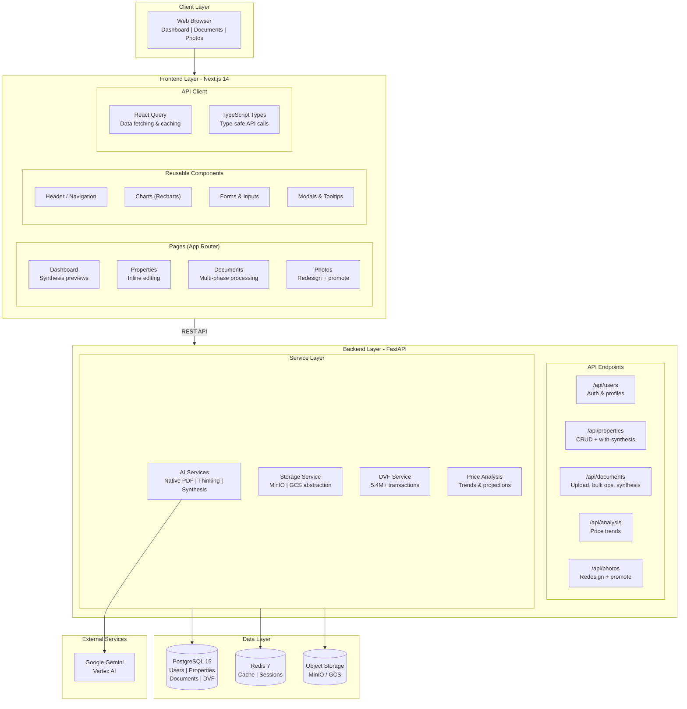
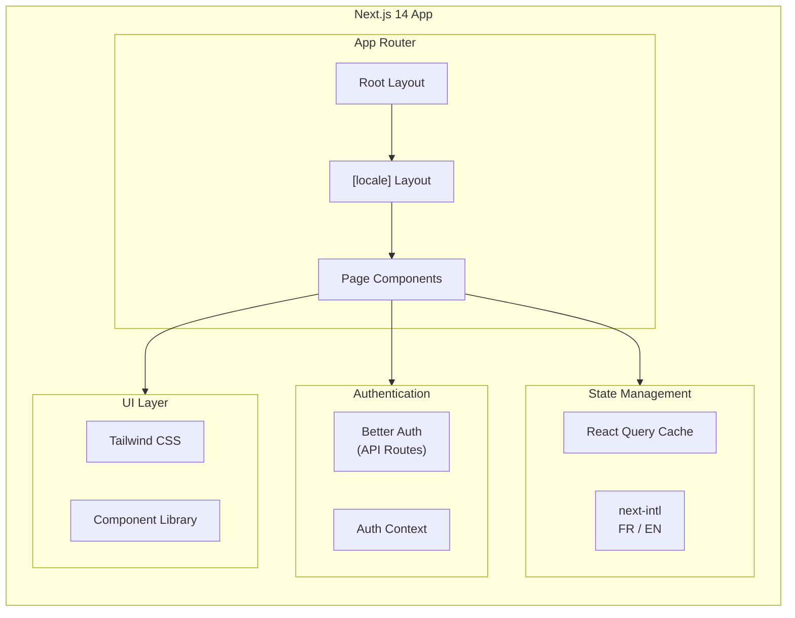
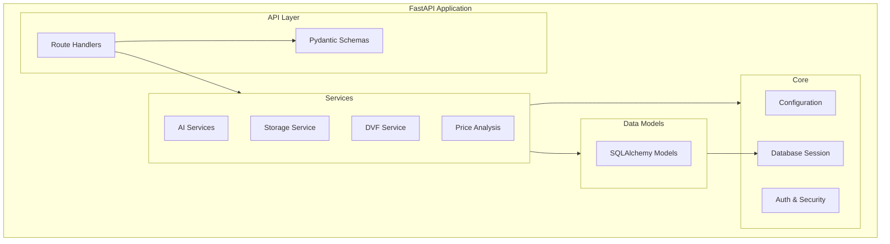
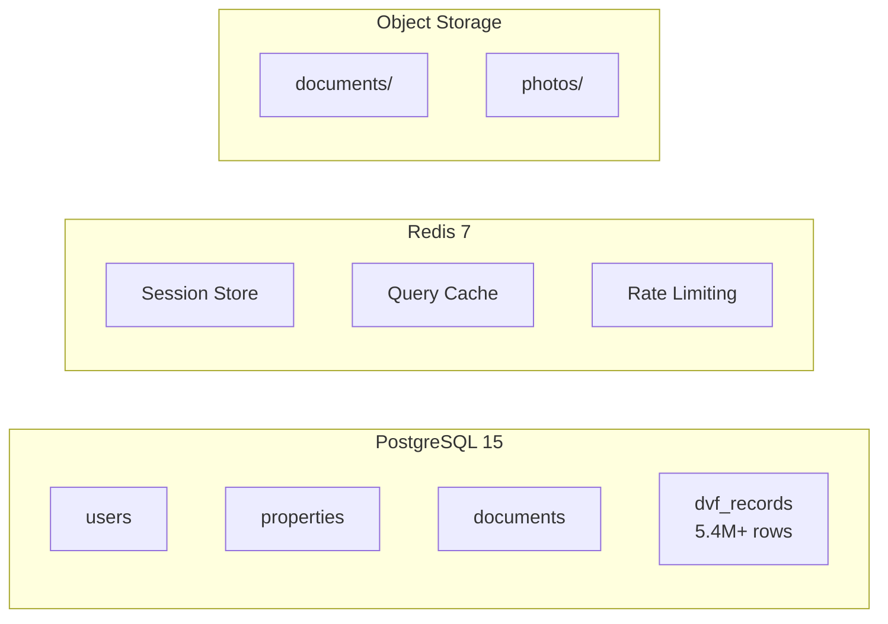
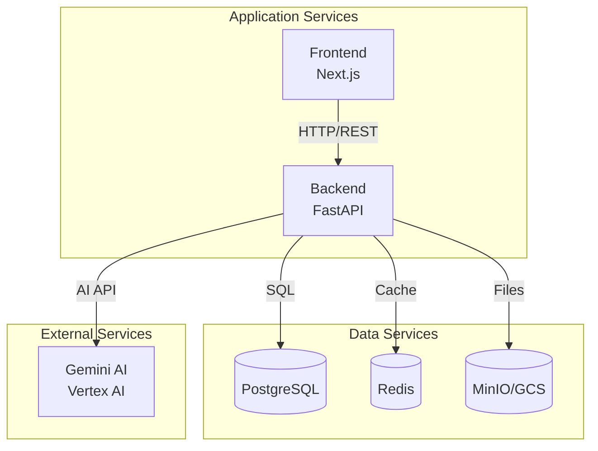
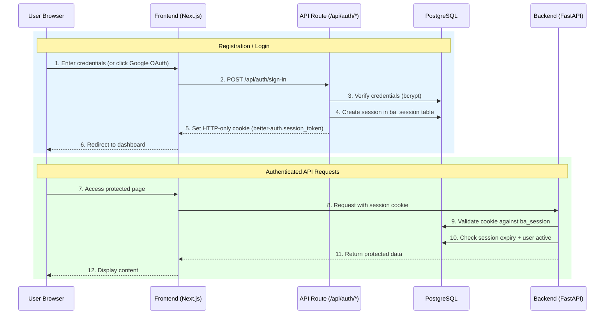
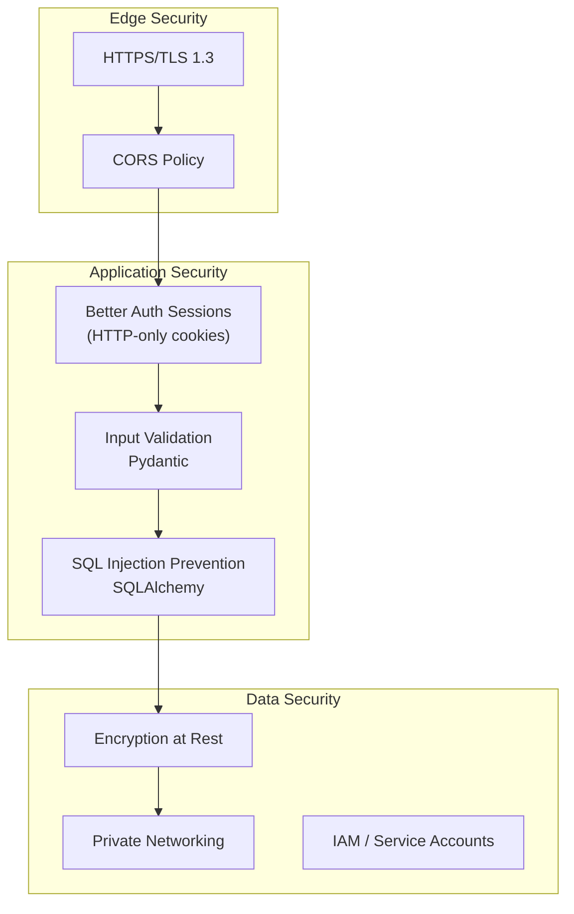
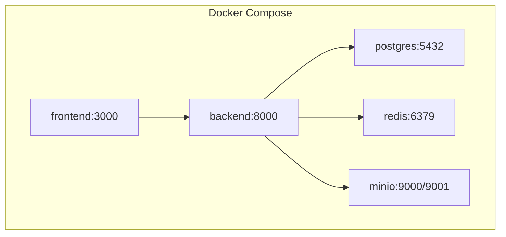
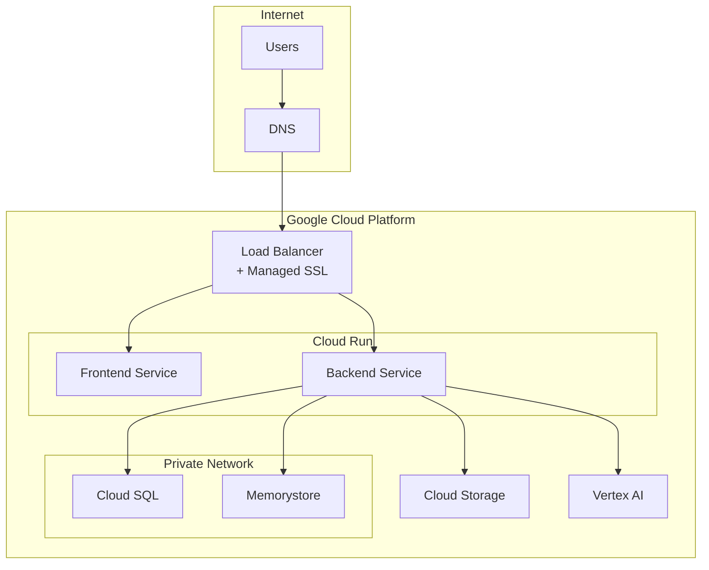

# System Overview

## High-Level Architecture

## Component Details

### Frontend Architecture

| Directory | Purpose |
|-----------|---------|
| `src/app/[locale]/` | Locale-scoped App Router pages |
| `src/app/api/auth/` | Better Auth API route handler |
| `src/components/` | Reusable React components |
| `src/contexts/` | React context providers (Auth) |
| `src/i18n/` | Internationalization config and routing |
| `src/lib/` | Utilities, API client, and auth config |
| `src/types/` | TypeScript type definitions |
| `messages/` | Translation files (en.json, fr.json) |

**Key Technologies**:

- **React 18** with Server Components
- **Better Auth** for authentication (email/password + Google OAuth)
- **next-intl** for internationalization (FR/EN)
- **Tailwind CSS** for styling
- **React Query** for data fetching and caching
- **TypeScript** for type safety
- **pnpm** for package management

### Backend Architecture

| Directory | Purpose |
|-----------|---------|
| `app/api/` | REST API route handlers |
| `app/core/` | Configuration, database, security |
| `app/models/` | SQLAlchemy ORM models |
| `app/schemas/` | Pydantic request/response schemas |
| `app/services/` | Business logic and integrations |
| `app/prompts/` | AI prompt templates (versioned) |

**Key Technologies**:

- **FastAPI** for async HTTP handling
- **SQLAlchemy 2.0** for ORM
- **Pydantic v2** for validation
- **Google Generative AI SDK** for Gemini
- **UV** for fast package management

### Data Layer

#### PostgreSQL

Stores structured data:

| Table | Records | Purpose |
|-------|---------|---------|
| `users` | ~100s | User accounts and profile data |
| `ba_user` | ~100s | Better Auth user accounts |
| `ba_session` | ~100s | Better Auth active sessions |
| `ba_account` | ~100s | Better Auth OAuth provider links |
| `properties` | ~100s | Properties and their metadata |
| `documents` | ~1000s | Documents and analysis results (5 categories) |
| `document_summaries` | ~100s | Cross-document synthesis with user overrides |
| `dvf_records` | 5.4M+ | French property transactions (2022-2025) |

#### Redis

In-memory caching for:

- Session data (7-day TTL)
- Frequently accessed queries (1-hour TTL)
- Rate limiting counters

#### Object Storage (MinIO / GCS)

File storage for:

- Uploaded documents (PDFs, images)
- Generated images (photo redesigns)
- Presigned URLs for secure browser access

## Service Dependencies

## Security Architecture

### Authentication Flow (Better Auth)

Authentication is handled by [Better Auth](https://www.better-auth.com/) on the frontend via Next.js API routes. The backend validates sessions by checking cookies against the `ba_session` database table.

**Key differences from legacy JWT:**

- No tokens stored in localStorage — HTTP-only cookies only
- Session state lives in PostgreSQL (`ba_session` table), not in the token
- Google OAuth supported as an optional provider
- Backend validates by querying the database, not by verifying a JWT signature

### Security Layers

### API Security

| Layer | Protection |
|-------|------------|
| Transport | HTTPS with TLS 1.3 |
| Origin | CORS restricted to allowed origins |
| Rate Limiting | Redis-based request throttling |
| Authentication | Better Auth session cookies (7-day expiry) |
| Authorization | Role-based access control |
| Input | Pydantic schema validation |
| Database | SQLAlchemy parameterized queries |

### Storage Security

| Environment | Authentication | Access Control |
|-------------|----------------|----------------|
| **Local (MinIO)** | Access keys | Bucket policies |
| **Production (GCS)** | Service account | IAM roles |
| **Browser Access** | Presigned URLs | Time-limited (15 min) |

## Deployment Architecture

### Local Development

### Production (GCP)

## Technology Stack Summary

| Layer | Technology | Purpose |
|-------|------------|---------|
| **Frontend** | Next.js 14 | React framework with App Router |
| | TypeScript | Type safety |
| | Tailwind CSS | Utility-first styling |
| | React Query | Data fetching & caching |
| | pnpm | Package management |
| **Backend** | FastAPI | Async Python web framework |
| | SQLAlchemy 2.0 | ORM |
| | Pydantic v2 | Data validation |
| | UV | Fast package management |
| **AI** | Google Gemini | Multimodal AI (vision + text) |
| | Vertex AI | Managed AI platform |
| **Database** | PostgreSQL 15 | Primary data store |
| | Redis 7 | Caching & sessions |
| **Storage** | MinIO | Local S3-compatible storage |
| | Google Cloud Storage | Production file storage |
| **Infrastructure** | Docker | Containerization |
| | Terraform | Infrastructure as Code |
| | GCP Cloud Run | Serverless containers |
