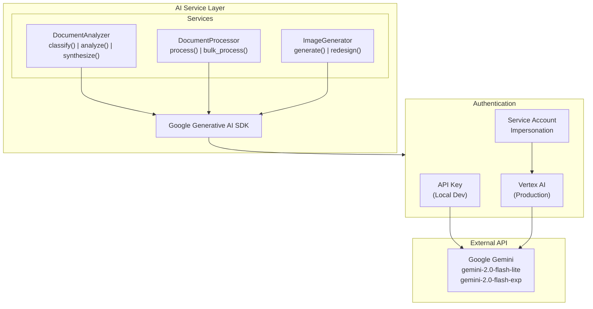
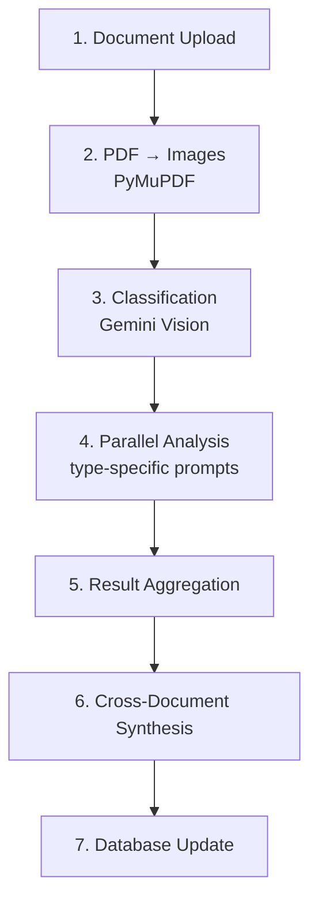

# AI Services

AppArt Agent uses Google Gemini for document analysis, classification, and image generation.

## Overview

| Service | Model | Purpose |
|---------|-------|---------|
| Document Analysis | `gemini-2.0-flash-lite` | Text and vision-based document parsing |
| Image Generation | `gemini-2.0-flash-exp` | Photo redesign and visualization |

## Architecture



## Document Analyzer

The `DocumentAnalyzer` class provides text and vision-based document analysis.

### Initialization

```python
from app.services.ai.document_analyzer import DocumentAnalyzer

analyzer = DocumentAnalyzer()
```

The analyzer automatically configures:

- **API Key mode**: Uses `GOOGLE_CLOUD_API_KEY` for direct API access
- **Vertex AI mode**: Uses service account for GCP production

### Document Classification

Automatically identifies document types using vision analysis:

```python
classification = await analyzer.classify_document(
    images=[pdf_page_image],  # First page as image
    filename="pv_ag_2024.pdf"
)

# Returns:
{
    "document_type": "pv_ag",
    "confidence": 0.95,
    "reasoning": "Document contains assembly meeting minutes header..."
}
```

**Supported Document Types**:

| Type | Description |
|------|-------------|
| `pv_ag` | Procès-verbal d'Assemblée Générale (meeting minutes) |
| `diagnostic_dpe` | Diagnostic de Performance Énergétique |
| `diagnostic_amiante` | Amiante (asbestos) report |
| `diagnostic_plomb` | Plomb (lead) report |
| `diagnostic_electric` | Electrical inspection |
| `diagnostic_gas` | Gas inspection |
| `tax_fonciere` | Taxe Foncière (property tax) |
| `charges` | Condominium charges |

### Document Analysis

Analyzes document content with type-specific prompts:

```python
analysis = await analyzer.analyze_document(
    document_type="pv_ag",
    images=pdf_images,  # All pages as images
    text_content=extracted_text  # Optional OCR text
)

# Returns structured analysis based on document type
```

### Multi-Document Synthesis

Aggregates analysis from multiple documents:

```python
synthesis = await analyzer.synthesize_documents(
    analyses=[
        {"document_type": "pv_ag", "analysis": {...}},
        {"document_type": "diagnostic_dpe", "analysis": {...}},
        {"document_type": "charges", "analysis": {...}}
    ]
)

# Returns:
{
    "summary": "Comprehensive property analysis...",
    "total_annual_cost": 4500.0,
    "total_one_time_cost": 25000.0,
    "risk_level": "medium",
    "key_findings": [...],
    "recommendations": [...]
}
```

## Document Processor

Orchestrates the full document processing pipeline.

### Bulk Processing

```python
from app.services.ai.document_processor import DocumentProcessor

processor = DocumentProcessor(db_session)

result = await processor.process_bulk_upload(
    property_id=1,
    documents=[
        {"id": 1, "file_path": "...", "filename": "pv_ag.pdf"},
        {"id": 2, "file_path": "...", "filename": "dpe.pdf"}
    ]
)
```

### Processing Pipeline



## Image Generator

Handles AI-powered image generation for photo redesigns.

### Photo Redesign

```python
from app.services.ai.image_generator import ImageGenerator

generator = ImageGenerator()

result = await generator.redesign_photo(
    original_image=image_bytes,
    style="modern",
    preferences={
        "color_scheme": "neutral",
        "furniture_style": "minimalist",
        "lighting": "bright"
    }
)

# Returns generated image bytes
```

### Supported Styles

| Style | Description |
|-------|-------------|
| `modern` | Clean lines, contemporary furniture |
| `scandinavian` | Light wood, minimal decoration |
| `industrial` | Exposed brick, metal accents |
| `bohemian` | Colorful, eclectic patterns |
| `classic` | Traditional furniture, rich colors |

## Prompt Management

Prompts are versioned and stored in `app/prompts/`:

```
prompts/
└── v1/
    ├── analyze_diagnostic.md
    ├── analyze_photo.md
    ├── analyze_pvag.md
    ├── analyze_tax_charges.md
    ├── generate_property_report.md
    ├── process_charges.md
    ├── process_diagnostic.md
    ├── process_pv_ag.md
    ├── process_tax.md
    ├── synthesize_documents.md
    ├── system_document_analyzer.md
    ├── system_document_classifier.md
    └── system_synthesis.md
```

### Loading Prompts

```python
from app.prompts import get_prompt, get_system_prompt

# Get analysis prompt
prompt = get_prompt("analyze_pvag", version="v1")

# Get system prompt
system = get_system_prompt("document_classifier", version="v1")
```

## Configuration

### Environment Variables

```bash
# Model selection
GEMINI_LLM_MODEL=gemini-2.0-flash-lite      # Text analysis
GEMINI_IMAGE_MODEL=gemini-2.0-flash-exp     # Image generation

# Authentication (choose one)
GOOGLE_CLOUD_API_KEY=your_api_key           # Direct API
GEMINI_USE_VERTEXAI=true                    # Use Vertex AI
GOOGLE_CLOUD_PROJECT=your_project           # Required for Vertex AI
GOOGLE_CLOUD_LOCATION=us-central1           # Vertex AI region
```

### Authentication Methods

| Method | Use Case | Configuration |
|--------|----------|---------------|
| **API Key** | Local development (simple) | `GOOGLE_CLOUD_API_KEY` |
| **Vertex AI + Impersonation** | Local development (production parity) | See below |
| **Vertex AI + Service Account** | Production (Cloud Run) | Automatic via attached SA |

### Local Development with Vertex AI (Recommended)

For testing with the same Vertex AI setup as production, use service account impersonation:

```bash
# 1. Grant impersonation permission (one-time)
gcloud iam service-accounts add-iam-policy-binding \
  appart-backend@YOUR_PROJECT.iam.gserviceaccount.com \
  --member="user:YOUR_EMAIL@gmail.com" \
  --role="roles/iam.serviceAccountTokenCreator" \
  --project=YOUR_PROJECT

# 2. Login with impersonation
gcloud auth application-default login \
  --impersonate-service-account=appart-backend@YOUR_PROJECT.iam.gserviceaccount.com

# 3. Configure environment
GEMINI_USE_VERTEXAI=true
GOOGLE_CLOUD_PROJECT=YOUR_PROJECT
GOOGLE_CLOUD_LOCATION=europe-west1

# 4. Start with GCS (uses ADC automatically)
./dev.sh start-gcs
```

This ensures you test with:
- Same Vertex AI models as production
- Same IAM permissions as the deployed service
- No API key management required

### Token Limits

| Operation | Max Tokens |
|-----------|-----------|
| Classification | 1,024 |
| Document Analysis | 4,096 |
| Synthesis | 8,192 |
| Image Generation | N/A |

## Error Handling

The AI services handle common errors gracefully:

```python
try:
    result = await analyzer.analyze_document(...)
except RateLimitError:
    # Implement exponential backoff
    await asyncio.sleep(delay)
    retry()
except InvalidResponseError:
    # Log and return partial result
    logger.error("Invalid AI response")
    return {"error": "Analysis incomplete"}
```

## Cost Optimization

1. **Use appropriate models**: `flash-lite` for text, `flash-exp` for images
2. **Batch requests**: Process multiple pages in single API call
3. **Cache results**: Store analysis results in database
4. **Skip unchanged**: Use file hashes to avoid re-processing

## Testing AI Services

```python
# tests/test_ai_services.py
import pytest
from app.services.ai.document_analyzer import DocumentAnalyzer

@pytest.mark.asyncio
async def test_document_classification():
    analyzer = DocumentAnalyzer()
    result = await analyzer.classify_document(
        images=[test_image],
        filename="test_pv_ag.pdf"
    )
    assert result["document_type"] in ["pv_ag", "diagnostic", "tax", "charges"]
```
