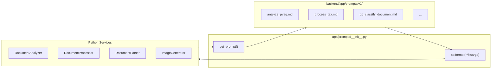

# Prompt Templates

All AI prompts are stored as versioned Markdown files in `backend/app/prompts/v1/`. This makes prompts easy to read, edit, and version independently from the Python code.

## Architecture



## Usage

```python
from app.prompts import get_prompt, get_system_prompt

# Load and format a prompt
prompt = get_prompt("dp_process_pv_ag", filename="pv_2024.pdf", output_language="French")

# Load a system prompt (auto-prefixes with "system_")
system = get_system_prompt("document_analyzer")

# List all available prompts
from app.prompts import list_prompts
prompts = list_prompts("v1")  # ["analyze_pvag", "process_tax", ...]
```

## Template Variables

Templates use Python `str.format()` syntax. Variables are wrapped in `{curly_braces}`:

```markdown
Analyze this {doc_type} document.
Respond in {output_language}.
```

**Important:** Literal JSON braces in templates must be escaped as `{{` and `}}`:

```markdown
Return your response as JSON:
{{
  "summary": "...",
  "costs": []
}}
```

If you forget to escape, `str.format()` will silently fail and variables like `{output_language}` won't be substituted.

## Template Catalog

### Document Analyzer (used by `DocumentAnalyzer`)

| Template | Variables | Purpose |
|----------|-----------|---------|
| `system_document_analyzer.md` | — | System prompt for document analysis |
| `system_document_classifier.md` | — | System prompt for classification |
| `analyze_pvag.md` | `{output_language}` | Analyze PV d'AG documents |
| `analyze_diagnostic.md` | `{output_language}` | Analyze diagnostic documents |
| `analyze_tax_charges.md` | `{output_language}` | Analyze tax/charges documents |
| `analyze_photo.md` | `{output_language}` | Analyze property photos |
| `synthesize_documents.md` | `{output_language}` | Cross-document synthesis |
| `system_synthesis.md` | — | System prompt for synthesis |
| `generate_property_report.md` | `{output_language}` | Full property report |

### Document Processor (used by `DocumentProcessor`)

| Template | Variables | Purpose |
|----------|-----------|---------|
| `dp_classify_document.md` | `{filename}` | Classify document type (5 categories) |
| `dp_process_pv_ag.md` | `{filename}`, `{output_language}` | Process PV d'AG (assembly minutes) |
| `dp_process_diagnostic.md` | `{filename}`, `{output_language}` | Process diagnostic documents (DPE, amiante, plomb, etc.) |
| `dp_process_tax.md` | `{filename}`, `{output_language}` | Process property tax documents |
| `dp_process_charges.md` | `{filename}`, `{output_language}` | Process copropriete charges |
| `dp_process_other.md` | `{filename}`, `{output_language}` | Process other documents (rules, contracts, insurance) |
| `dp_synthesize_results.md` | `{summaries}`, `{output_language}` | Cross-document synthesis with cost breakdowns, tantiemes, risk factors, buyer action items, and confidence scoring |

### Document Parser (used by `DocumentParser`)

| Template | Variables | Purpose |
|----------|-----------|---------|
| `parse_pv_ag.md` | `{output_language}` | Parse PV d'AG pages |
| `parse_diagnostic.md` | `{subcategory}`, `{output_language}` | Parse diagnostic pages |
| `parse_tax_charges.md` | `{doc_type}`, `{output_language}` | Parse tax/charges pages |
| `aggregate_pv_ag.md` | `{documents_json}`, `{output_language}` | Aggregate PV summaries |
| `aggregate_diagnostic.md` | `{documents_json}`, `{output_language}` | Aggregate diagnostic summaries |

### Legacy Processor Templates

| Template | Variables | Purpose |
|----------|-----------|---------|
| `process_pv_ag.md` | `{output_language}` | Process PV d'AG (legacy) |
| `process_diagnostic.md` | `{output_language}` | Process diagnostics (legacy) |
| `process_tax.md` | `{output_language}` | Process tax (legacy) |
| `process_charges.md` | `{output_language}` | Process charges (legacy) |

### Image Generator (used by `ImageGenerator`)

| Template | Variables | Purpose |
|----------|-----------|---------|
| `redesign_modern_norwegian.md` | `{room_type}` | Modern Norwegian style prompt |
| `redesign_minimalist_scandinavian.md` | `{room_type}` | Minimalist Scandinavian style |
| `redesign_cozy_hygge.md` | `{room_type}` | Cozy Hygge style |

## Versioning

Templates are organized by version folder (`v1/`, `v2/`, etc.). The default version is `v1`:

```text
backend/app/prompts/
├── __init__.py          # get_prompt(), get_system_prompt(), list_prompts()
├── v1/
│   ├── analyze_pvag.md
│   ├── dp_classify_document.md
│   └── ...
└── shared/              # Fallback for prompts not found in version folder
```

To use a different version:

```python
prompt = get_prompt("analyze_pvag", version="v2")
```

## Modifying Prompts

1. Edit the `.md` file directly in `backend/app/prompts/v1/`
2. Make sure all `{variables}` are documented and passed by the calling service
3. Escape literal JSON braces as `{{` / `}}`
4. Test with: `python -c "from app.prompts import get_prompt; print(get_prompt('template_name', var1='test'))"`
