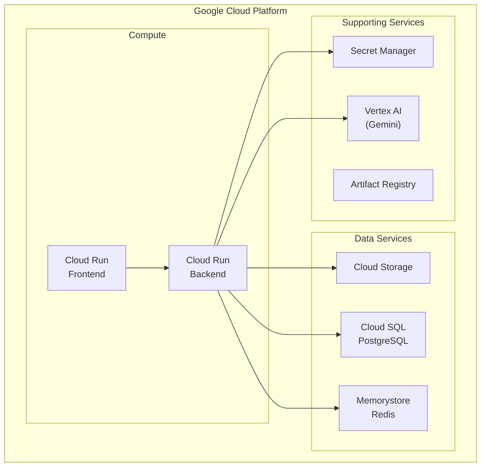

# GCP Cloud Run Deployment

Deploy Appartment Agent to Google Cloud Platform using Cloud Run, Cloud SQL, and other managed services.

## Architecture



## Cost Estimation

| Service | Tier | Monthly Cost |
|---------|------|--------------|
| Cloud Run (Frontend) | 0-10 instances | $0-50 |
| Cloud Run (Backend) | 0-10 instances | $0-100 |
| Cloud SQL PostgreSQL | db-f1-micro (dev) | ~$10 |
| Cloud SQL PostgreSQL | db-custom-2-4096 (prod) | ~$50 |
| Memorystore Redis | BASIC 1GB | ~$35 |
| Cloud Storage | ~10GB | ~$0.50 |
| **Total (Dev)** | | **~$50/month** |
| **Total (Production)** | | **~$150/month** |

## Prerequisites

1. GCP project with billing enabled
2. gcloud CLI installed and authenticated
3. Terraform >= 1.5.0
4. GitHub repository with Actions enabled

## Initial Setup

### 1. Configure GCP

```bash
# Set project
export PROJECT_ID="your-project-id"
export REGION="europe-west1"

# Authenticate
gcloud auth login
gcloud config set project $PROJECT_ID
```

### 2. Enable APIs

```bash
gcloud services enable \
  run.googleapis.com \
  sqladmin.googleapis.com \
  redis.googleapis.com \
  secretmanager.googleapis.com \
  artifactregistry.googleapis.com \
  cloudbuild.googleapis.com \
  vpcaccess.googleapis.com \
  servicenetworking.googleapis.com \
  compute.googleapis.com \
  aiplatform.googleapis.com
```

### 3. Create Service Account

```bash
# Create service account
gcloud iam service-accounts create appartment-deployer \
  --display-name="Appartment Agent Deployer"

SA_EMAIL="appartment-deployer@$PROJECT_ID.iam.gserviceaccount.com"

# Grant permissions
for role in run.admin iam.serviceAccountUser artifactregistry.writer \
            secretmanager.secretAccessor storage.admin; do
  gcloud projects add-iam-policy-binding $PROJECT_ID \
    --member="serviceAccount:$SA_EMAIL" \
    --role="roles/$role"
done

# Create key for CI/CD
gcloud iam service-accounts keys create deployer-key.json \
  --iam-account=$SA_EMAIL

# Get base64 encoded key for GitHub
cat deployer-key.json | base64
```

### 4. Configure GitHub Secrets

Add to your GitHub repository settings:

| Secret | Description |
|--------|-------------|
| `GCP_PROJECT_ID` | Your GCP project ID |
| `GCP_REGION` | GCP region (e.g., `europe-west1`) |
| `GCP_SA_KEY` | Service account key (base64 encoded) |

## Terraform Deployment

### 1. Configure Variables

```bash
cd infra/terraform
cp terraform.tfvars.example terraform.tfvars
```

Edit `terraform.tfvars`:

```hcl
project_id = "your-project-id"
region     = "europe-west1"
environment = "production"
```

### 2. Initialize Terraform

```bash
terraform init
```

### 3. Review Plan

```bash
terraform plan
```

### 4. Apply Infrastructure

```bash
terraform apply
```

This creates:

- VPC network with private subnet
- Cloud SQL PostgreSQL instance
- Memorystore Redis instance
- Cloud Storage buckets
- Artifact Registry repository
- VPC connector for Cloud Run
- Secret Manager secrets

## Secrets Configuration

### Set Required Secrets

```bash
# Database password (auto-generated by Terraform)
# JWT secret key
echo -n "$(openssl rand -base64 32)" | \
  gcloud secrets versions add jwt-secret-key --data-file=-

# Google Cloud API key
echo -n "your-api-key" | \
  gcloud secrets versions add google-cloud-api-key --data-file=-
```

### Logfire token (optional)

To enable [Logfire](https://logfire.pydantic.dev/) observability:

1. Create a write token in the [Logfire dashboard](https://logfire.pydantic.dev/).
2. Store it in Secret Manager (Terraform creates the secret; you add the value):

```bash
# After terraform apply (secret "logfire-token" exists)
echo -n "YOUR_LOGFIRE_WRITE_TOKEN" | \
  gcloud secrets versions add logfire-token --data-file=-
```

Or pass the token when applying Terraform (stored in state, sensitive):

```bash
terraform apply -var="logfire_token=YOUR_LOGFIRE_WRITE_TOKEN"
```

3. Redeploy the backend so it picks up the new secret (or run `terraform apply` again).

## Deploy Application

### Automatic (GitHub Actions)

Push to main branch triggers deployment:

```bash
git push origin main
```

The workflow:

1. Builds Docker images
2. Pushes to Artifact Registry
3. Deploys to Cloud Run
4. Runs database migrations

### Manual Deployment

```bash
# Build and push backend
cd backend
docker build -t $REGION-docker.pkg.dev/$PROJECT_ID/appartment-agent/backend:latest \
  --target production .
docker push $REGION-docker.pkg.dev/$PROJECT_ID/appartment-agent/backend:latest

# Build and push frontend
cd ../frontend
docker build -t $REGION-docker.pkg.dev/$PROJECT_ID/appartment-agent/frontend:latest \
  --target production -f Dockerfile.pnpm .
docker push $REGION-docker.pkg.dev/$PROJECT_ID/appartment-agent/frontend:latest

# Deploy backend
gcloud run deploy appartment-backend \
  --image $REGION-docker.pkg.dev/$PROJECT_ID/appartment-agent/backend:latest \
  --region $REGION \
  --platform managed \
  --allow-unauthenticated

# Deploy frontend
gcloud run deploy appartment-frontend \
  --image $REGION-docker.pkg.dev/$PROJECT_ID/appartment-agent/frontend:latest \
  --region $REGION \
  --platform managed \
  --allow-unauthenticated
```

## Database Migrations

Run migrations after deployment:

```bash
# Create migration job
gcloud run jobs create db-migrate \
  --image $REGION-docker.pkg.dev/$PROJECT_ID/appartment-agent/backend:latest \
  --region $REGION \
  --memory 1Gi \
  --command "alembic" \
  --args "upgrade,head"

# Execute migration
gcloud run jobs execute db-migrate --region $REGION --wait
```

## Environment Variables

### Backend (Cloud Run)

| Variable | Source | Description |
|----------|--------|-------------|
| `ENVIRONMENT` | Direct | `production` |
| `DATABASE_URL` | Secret Manager | PostgreSQL URL |
| `SECRET_KEY` | Secret Manager | JWT signing key |
| `LOGFIRE_TOKEN` | Secret Manager | Logfire write token (optional) |
| `LOGFIRE_ENABLED` | Direct | `true` when using Logfire |
| `GOOGLE_CLOUD_PROJECT` | Direct | GCP project ID |
| `GEMINI_USE_VERTEXAI` | Direct | `true` |
| `STORAGE_BACKEND` | Direct | `gcs` |
| `GCS_DOCUMENTS_BUCKET` | Direct | Documents bucket |
| `REDIS_HOST` | Direct | Memorystore IP |

### Frontend (Cloud Run)

| Variable | Description |
|----------|-------------|
| `NEXT_PUBLIC_API_URL` | Backend Cloud Run URL |
| `NODE_ENV` | `production` |

## Custom Domain

### 1. Verify Domain

```bash
gcloud domains verify your-domain.com
```

### 2. Create Domain Mapping

```bash
gcloud run domain-mappings create \
  --service appartment-frontend \
  --domain app.your-domain.com \
  --region $REGION
```

### 3. Update DNS

Add the DNS records provided by GCP to your domain registrar.

## Monitoring

### View Logs

```bash
# Backend logs
gcloud run services logs read appartment-backend --region $REGION

# Real-time logs
gcloud run services logs tail appartment-backend --region $REGION

# Filtered logs
gcloud run services logs read appartment-backend --region $REGION \
  --limit 100 --log-filter 'severity>=ERROR'
```

### Cloud Monitoring

Set up alerts for:

- Error rate > 1%
- Latency p95 > 2s
- Instance count at maximum

## Scaling

### Auto-Scaling Configuration

Cloud Run auto-scales based on traffic:

```hcl
# In Terraform
scaling {
  min_instance_count = 1  # Keep warm (production)
  max_instance_count = 10 # Maximum instances
}
```

### Cold Start Optimization

1. Set `min_instance_count = 1` for production
2. Optimize container startup time
3. Use smaller base images

## Security

### Network Security

- VPC connector for private database access
- No public IP on Cloud SQL
- Automatic HTTPS on Cloud Run

### Secret Management

- Secrets stored in Secret Manager
- Accessed via IAM roles
- Never in environment files

### IAM Permissions

- Minimal permissions per service
- Service account per workload
- Regular permission audits

## Troubleshooting

### Container Won't Start

```bash
# Check logs
gcloud run services logs read appartment-backend --region $REGION --limit 100

# Check revision status
gcloud run revisions list --service appartment-backend --region $REGION
```

### Database Connection Issues

```bash
# Verify VPC connector
gcloud compute networks vpc-access connectors describe \
  appartment-agent-connector --region $REGION

# Test from Cloud Shell
gcloud sql connect appartment-agent-db --user=postgres
```

### Redis Connection Issues

```bash
# Check Redis instance
gcloud redis instances describe appartment-agent-cache --region $REGION
```

## Cleanup

To destroy all resources:

```bash
cd infra/terraform
terraform destroy
```

!!! danger "Warning"
    This deletes all data including the database. Create backups first!
