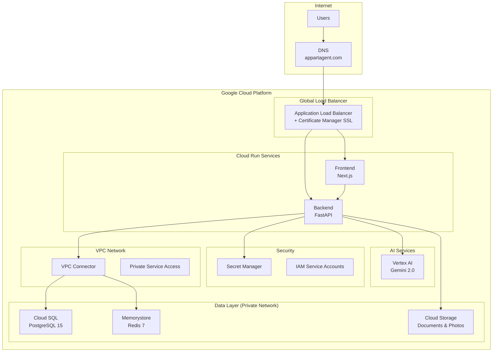
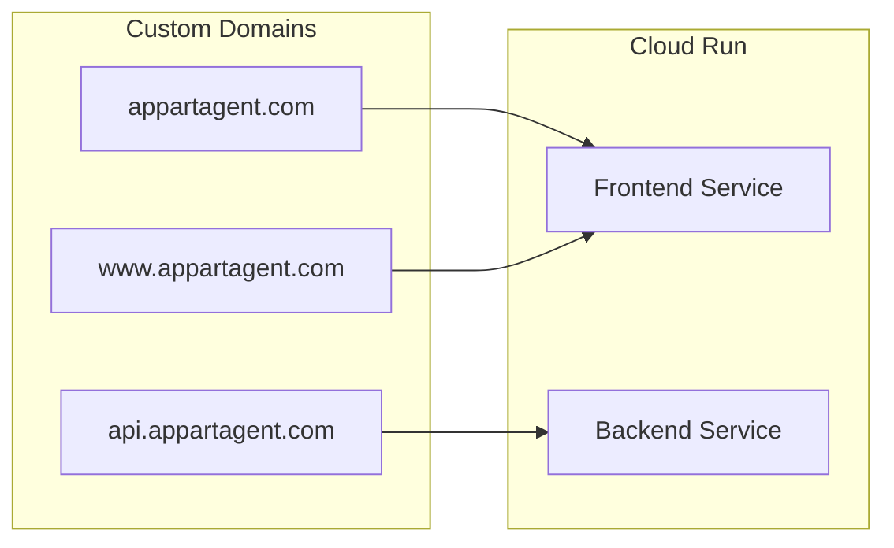
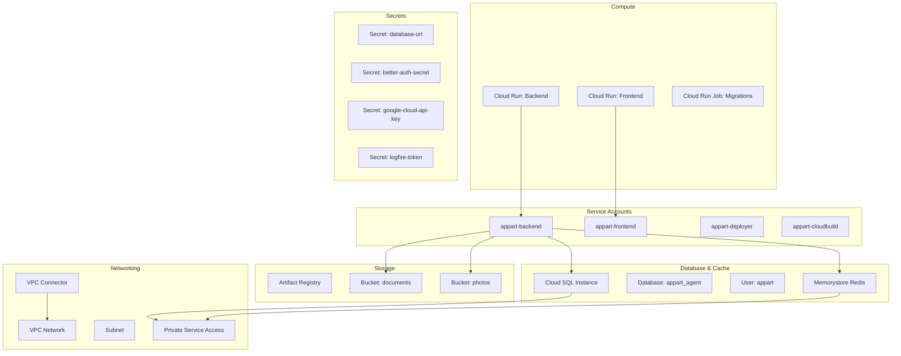
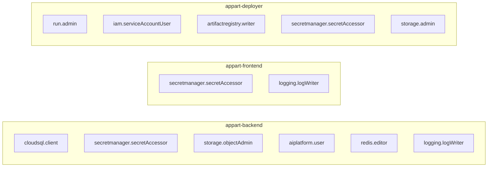
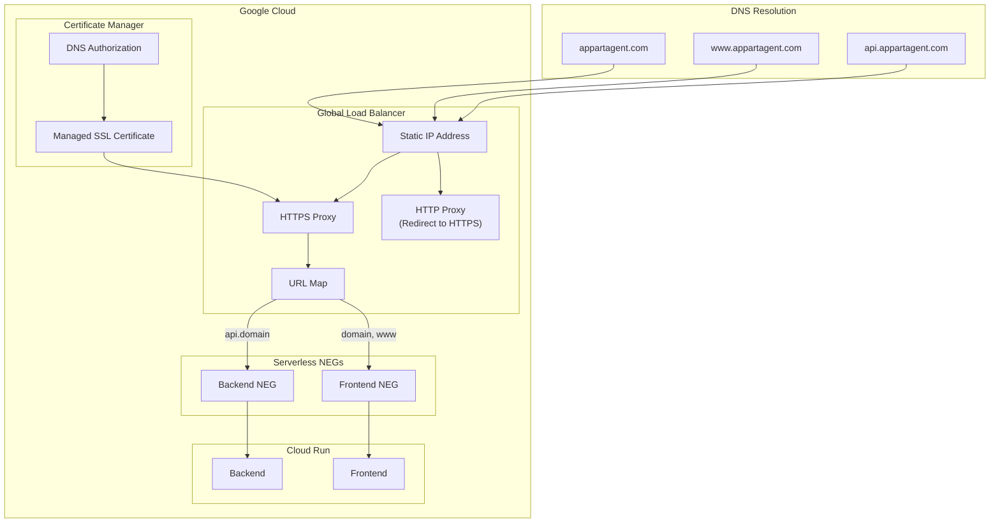
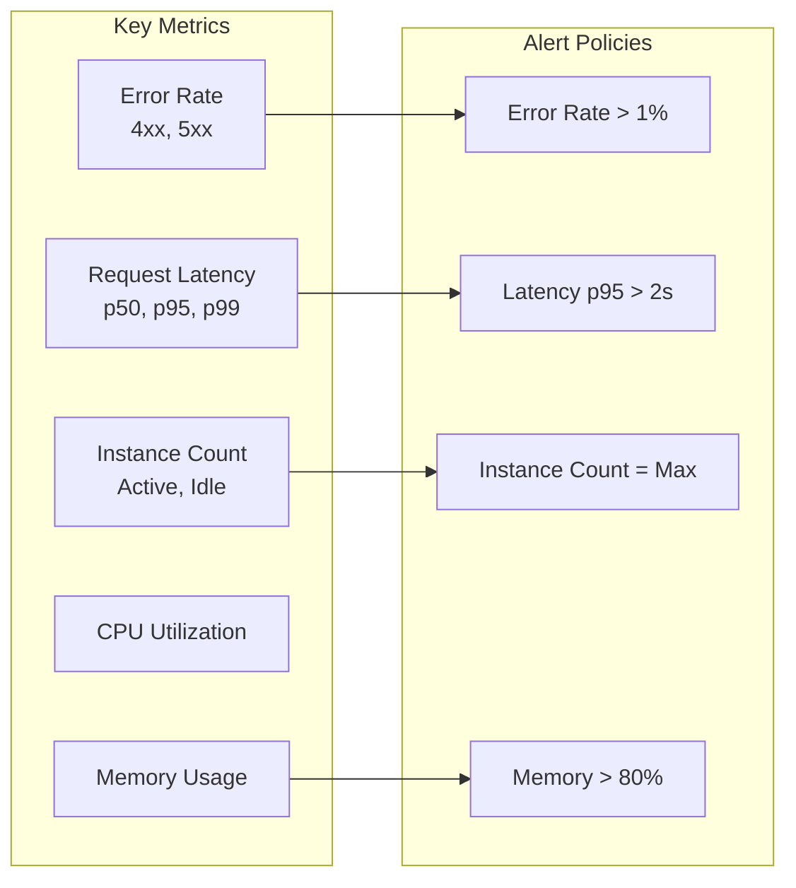
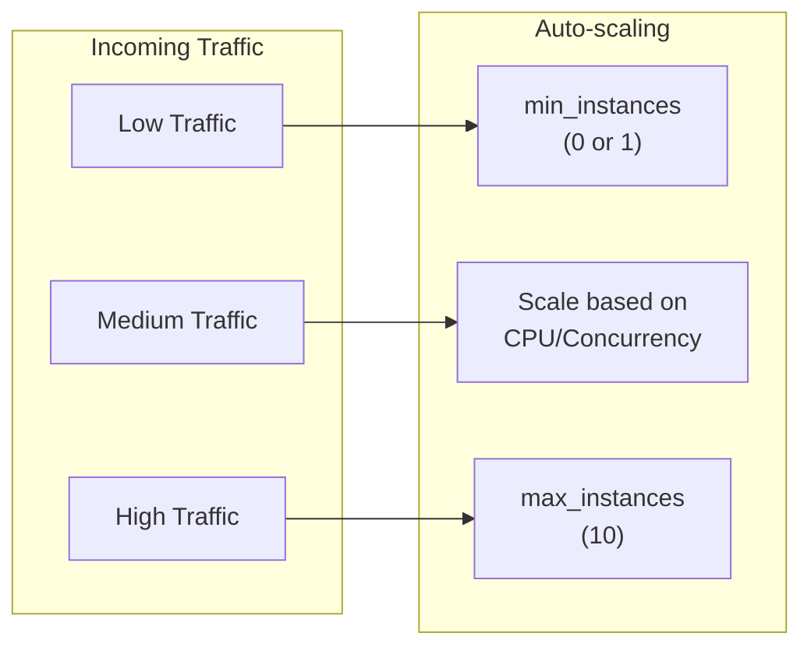
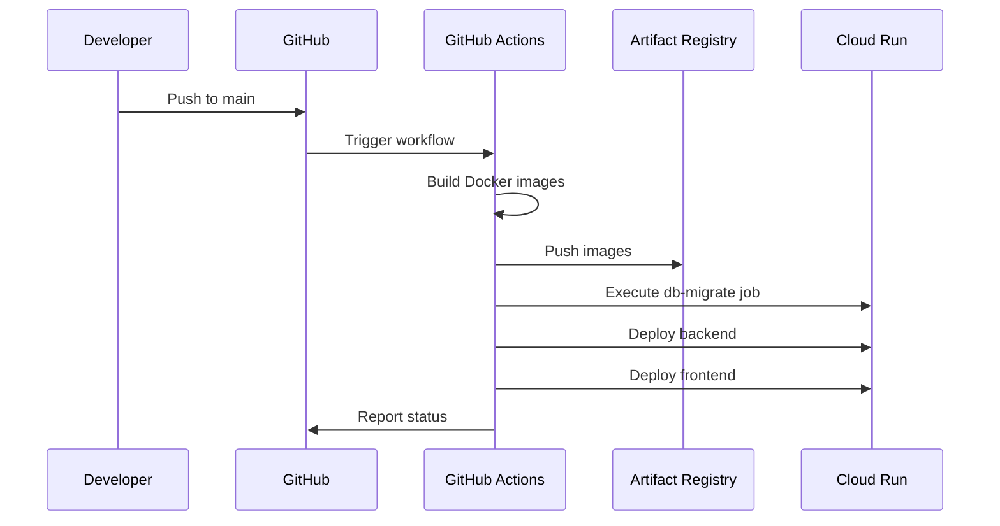
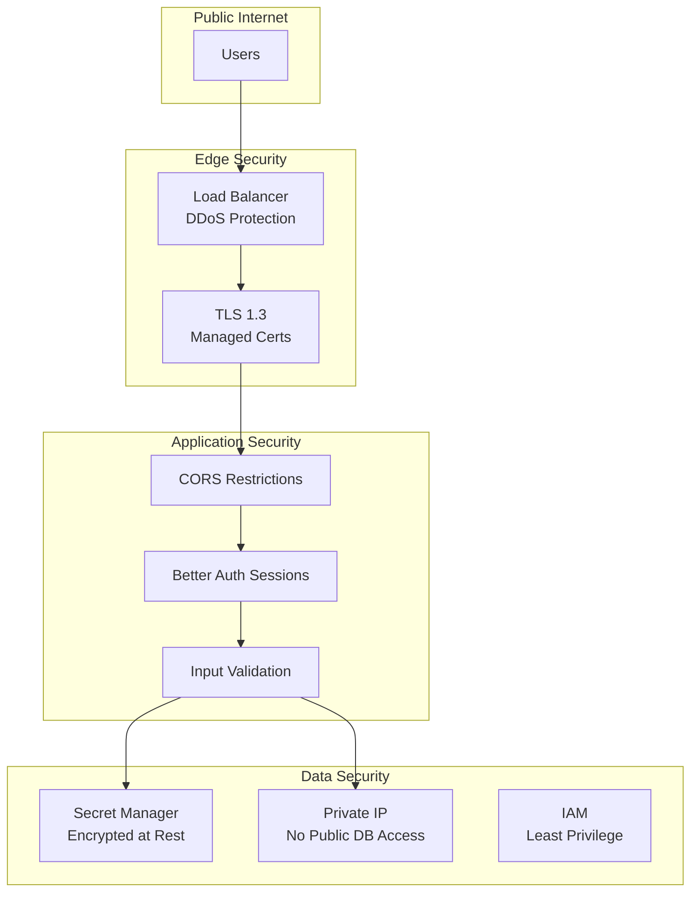

# GCP Cloud Run Deployment

Deploy AppArt Agent to Google Cloud Platform using Cloud Run, Cloud SQL, and managed services.

## Architecture Overview



## Domain Routing



## Prerequisites

### Required Tools

| Tool | Version | Installation |
|------|---------|--------------|
| gcloud CLI | Latest | [Install Guide](https://cloud.google.com/sdk/docs/install) |
| Terraform | >= 1.5.0 | [Install Guide](https://developer.hashicorp.com/terraform/install) |
| Docker | 20.10+ | [Install Guide](https://docs.docker.com/get-docker/) |

### GCP Requirements

- GCP Project with billing enabled
- Owner or Editor role on the project
- Domain name (optional, for custom domain)

### Cost Estimation

| Service | Development | Production |
|---------|-------------|------------|
| Cloud Run (Frontend) | $0-50/month | $50-100/month |
| Cloud Run (Backend) | $0-100/month | $100-200/month |
| Cloud SQL PostgreSQL | ~$10/month (db-f1-micro) | ~$50/month (db-custom-2-4096) |
| Memorystore Redis | ~$35/month (1GB BASIC) | ~$70/month (1GB STANDARD_HA) |
| Cloud Storage | ~$1/month | ~$5/month |
| Load Balancer | ~$20/month | ~$20/month |
| **Total** | **~$65-115/month** | **~$295-445/month** |

!!! tip "Cost Optimization"
    - Set `min_instances = 0` in Terraform to enable scale-to-zero (saves ~$50/month per service)
    - Use `db-f1-micro` for development/staging environments
    - Consider BASIC Redis tier for non-production workloads

## Quick Start Deployment

### 1. Initial Setup

```bash
# Clone repository
git clone https://github.com/benjamin-karaoglan/appart-agent.git
cd appart-agent

# Set environment variables
export PROJECT_ID="your-gcp-project-id"
export REGION="europe-west1"

# Authenticate with GCP
gcloud auth login
gcloud config set project $PROJECT_ID
```

### 2. Enable Required APIs

```bash
gcloud services enable \
  run.googleapis.com \
  sqladmin.googleapis.com \
  redis.googleapis.com \
  secretmanager.googleapis.com \
  artifactregistry.googleapis.com \
  cloudbuild.googleapis.com \
  vpcaccess.googleapis.com \
  servicenetworking.googleapis.com \
  compute.googleapis.com \
  aiplatform.googleapis.com \
  dns.googleapis.com \
  certificatemanager.googleapis.com
```

### 3. Deploy Infrastructure with Terraform

```bash
cd infra/terraform

# Create variables file
cat > terraform.tfvars << EOF
project_id = "$PROJECT_ID"
region     = "$REGION"
environment = "production"

# Optional: Custom domain
# domain = "yourdomain.com"
# use_load_balancer = true
EOF

# Initialize and apply
terraform init
terraform plan
terraform apply
```

### 4. Build and Push Docker Images

```bash
# Configure Docker for Artifact Registry
gcloud auth configure-docker $REGION-docker.pkg.dev

# Build and push backend
docker build -t $REGION-docker.pkg.dev/$PROJECT_ID/appart-agent/backend:latest \
  --target production ./backend
docker push $REGION-docker.pkg.dev/$PROJECT_ID/appart-agent/backend:latest

# Build and push frontend
docker build -t $REGION-docker.pkg.dev/$PROJECT_ID/appart-agent/frontend:latest \
  --target production -f ./frontend/Dockerfile.pnpm ./frontend
docker push $REGION-docker.pkg.dev/$PROJECT_ID/appart-agent/frontend:latest
```

### 5. Run Database Migrations

```bash
# Execute migration job
gcloud run jobs execute db-migrate --region $REGION --wait
```

### 6. Deploy Cloud Run Services

```bash
# Deploy backend
gcloud run deploy appart-backend \
  --image $REGION-docker.pkg.dev/$PROJECT_ID/appart-agent/backend:latest \
  --region $REGION

# Deploy frontend
gcloud run deploy appart-frontend \
  --image $REGION-docker.pkg.dev/$PROJECT_ID/appart-agent/frontend:latest \
  --region $REGION
```

## Infrastructure Details

### Terraform Resources

The Terraform configuration creates:



### Terraform Variables

| Variable | Description | Default |
|----------|-------------|---------|
| `project_id` | GCP Project ID | Required |
| `region` | GCP Region | `europe-west1` |
| `environment` | Environment name | `production` |
| `domain` | Custom domain | `""` (none) |
| `use_load_balancer` | Use Cloud Load Balancer | `true` |
| `create_dns_zone` | Create Cloud DNS zone | `true` |
| `db_tier` | Cloud SQL instance tier | `db-f1-micro` |
| `redis_tier` | Redis tier | `BASIC` |
| `min_instances` | Minimum Cloud Run instances | `0` |

### Service Account Permissions



## Custom Domain Setup

### Architecture with Load Balancer



### Option 1: Using Cloud Load Balancer (Recommended)

This approach provides more reliable SSL certificate provisioning and better performance.

#### Step 1: Verify Domain Ownership

```bash
# Verify domain ownership (opens browser)
gcloud domains verify yourdomain.com
```

#### Step 2: Configure Terraform

```hcl
# terraform.tfvars
domain            = "yourdomain.com"
use_load_balancer = true
create_dns_zone   = true
api_subdomain     = "api"
```

#### Step 3: Apply Infrastructure

```bash
terraform apply
```

#### Step 4: Update DNS at Registrar

If using Cloud DNS (recommended):

```bash
# Get nameservers
terraform output dns_nameservers
```

Update your domain registrar to use the output nameservers:

- `ns-cloud-a1.googledomains.com.`
- `ns-cloud-a2.googledomains.com.`
- `ns-cloud-a3.googledomains.com.`
- `ns-cloud-a4.googledomains.com.`

#### Step 5: Verify SSL Certificate

```bash
# Check certificate status
gcloud certificate-manager certificates describe appart-agent-cert --location=global
```

SSL provisioning can take 15-60 minutes after DNS propagation.

### Option 2: Using External DNS

If you manage DNS outside GCP (Cloudflare, Namecheap, etc.):

```hcl
# terraform.tfvars
domain            = "yourdomain.com"
use_load_balancer = true
create_dns_zone   = false  # Don't create Cloud DNS zone
```

Then configure DNS records at your registrar:

| Type | Name | Value |
|------|------|-------|
| A | @ | `<load_balancer_ip>` |
| A | www | `<load_balancer_ip>` |
| A | api | `<load_balancer_ip>` |

Get the load balancer IP:

```bash
terraform output lb_ip
```

### Option 3: Cloud Run Domain Mappings (Simpler, Less Reliable)

For simpler setups without a load balancer:

```hcl
# terraform.tfvars
domain            = "yourdomain.com"
use_load_balancer = false
create_dns_zone   = false
```

Configure DNS records:

| Type | Name | Value |
|------|------|-------|
| A | @ | (See domain mapping status) |
| CNAME | www | ghs.googlehosted.com. |
| CNAME | api | ghs.googlehosted.com. |

```bash
# Get A record IPs
gcloud run domain-mappings describe \
  --domain yourdomain.com \
  --region $REGION \
  --format='value(status.resourceRecords)'
```

## Environment Variables

### Backend Configuration

Environment variables are set via Terraform and Secret Manager:

| Variable | Source | Description |
|----------|--------|-------------|
| `ENVIRONMENT` | Terraform | `production` |
| `DATABASE_URL` | Secret Manager | PostgreSQL connection string |
| `SECRET_KEY` | Secret Manager | Application secret key |
| `GOOGLE_CLOUD_PROJECT` | Terraform | GCP project ID |
| `GOOGLE_CLOUD_LOCATION` | Terraform | GCP region |
| `GEMINI_USE_VERTEXAI` | Terraform | `true` (uses Vertex AI) |
| `STORAGE_BACKEND` | Terraform | `gcs` |
| `GCS_DOCUMENTS_BUCKET` | Terraform | Documents bucket name |
| `GCS_PHOTOS_BUCKET` | Terraform | Photos bucket name |
| `REDIS_HOST` | Terraform | Redis IP address |
| `REDIS_PORT` | Terraform | Redis port (6379) |

### Frontend Configuration

| Variable | Source | Description |
|----------|--------|-------------|
| `NEXT_PUBLIC_API_URL` | Terraform | Backend URL (custom domain or Cloud Run URL) |
| `NEXT_PUBLIC_APP_URL` | Terraform | Frontend URL (custom domain or Cloud Run URL) |
| `DATABASE_URL` | Secret Manager | PostgreSQL connection string (for Better Auth) |
| `BETTER_AUTH_SECRET` | Secret Manager | Session signing secret (min 32 chars) |
| `NODE_ENV` | Terraform | `production` |
| `GOOGLE_CLIENT_ID` | Secret Manager | Google OAuth client ID (optional) |
| `GOOGLE_CLIENT_SECRET` | Secret Manager | Google OAuth client secret (optional) |

### Setting Secrets Manually

If you need to set secrets manually:

```bash
# Database URL (automatically set by Terraform)
echo -n "postgresql://..." | gcloud secrets versions add database-url --data-file=-

# Application Secret (automatically set by Terraform)
echo -n "your-secret-key" | gcloud secrets versions add jwt-secret --data-file=-

# Better Auth Secret (for frontend session signing)
echo -n "your-better-auth-secret" | gcloud secrets versions add better-auth-secret --data-file=-

# Google Cloud API Key (optional, for non-Vertex AI usage)
echo -n "your-api-key" | gcloud secrets versions add google-cloud-api-key --data-file=-

# Logfire Token (optional, for observability)
echo -n "your-logfire-token" | gcloud secrets versions add logfire-token --data-file=-
```

## Database Operations

### Running Migrations

```bash
# Using Cloud Run Job (recommended)
gcloud run jobs execute db-migrate --region $REGION --wait

# Check job logs
gcloud run jobs executions logs db-migrate --region $REGION
```

### Direct Database Access

For debugging or manual operations:

```bash
# Connect via Cloud SQL Auth Proxy
gcloud sql instances describe appart-agent-db --format='value(connectionName)'

# Install Cloud SQL Proxy
curl -o cloud-sql-proxy https://storage.googleapis.com/cloud-sql-connectors/cloud-sql-proxy/v2.8.0/cloud-sql-proxy.darwin.arm64
chmod +x cloud-sql-proxy

# Start proxy (in a separate terminal)
./cloud-sql-proxy $PROJECT_ID:$REGION:appart-agent-db

# Connect with psql
PGPASSWORD=$(gcloud secrets versions access latest --secret=db-password) \
  psql -h localhost -U appart -d appart_agent
```

### Backup and Restore

```bash
# Create on-demand backup
gcloud sql backups create --instance=appart-agent-db

# List backups
gcloud sql backups list --instance=appart-agent-db

# Restore from backup
gcloud sql backups restore <BACKUP_ID> \
  --restore-instance=appart-agent-db \
  --backup-instance=appart-agent-db
```

## Monitoring and Logging

### View Logs

```bash
# Backend logs
gcloud run services logs read appart-backend --region $REGION --limit 100

# Frontend logs
gcloud run services logs read appart-frontend --region $REGION --limit 100

# Real-time log streaming
gcloud run services logs tail appart-backend --region $REGION
```

### Log Explorer Queries

Access [Cloud Logging](https://console.cloud.google.com/logs) with these filters:

```text
# Backend errors
resource.type="cloud_run_revision"
resource.labels.service_name="appart-backend"
severity>=ERROR

# Slow requests (> 2s)
resource.type="cloud_run_revision"
httpRequest.latency>"2s"

# AI service calls
resource.type="cloud_run_revision"
jsonPayload.message=~"Gemini"
```

### Monitoring Dashboard



Set up alerts in Cloud Monitoring:

1. Navigate to **Monitoring > Alerting**
2. Create alerting policies for:
   - Error rate > 1%
   - Latency p95 > 2s
   - Instance count at maximum
   - Memory utilization > 80%

### Logfire Integration (Optional)

For enhanced observability:

```bash
# Set Logfire token
echo -n "your-logfire-token" | gcloud secrets versions add logfire-token --data-file=-
```

The backend automatically sends traces and logs to Logfire when `LOGFIRE_ENABLED=true`.

!!! warning "VPC Egress Configuration"
    Logfire requires external network access. The VPC connector must use `PRIVATE_RANGES_ONLY` egress
    (not `ALL_TRAFFIC`) to allow the backend to reach `logfire-eu.pydantic.dev`. If using `ALL_TRAFFIC`,
    you must configure Cloud NAT for the VPC.

    The Terraform configuration uses `PRIVATE_RANGES_ONLY` by default, which routes only internal
    traffic (Cloud SQL, Redis) through the VPC while allowing external traffic (Logfire, Vertex AI)
    to use the default internet egress.

## Scaling Configuration

### Auto-scaling Settings



### Terraform Configuration

```hcl
# Scale to zero (cost-efficient, cold starts)
min_instances = 0
max_instances = 10

# Always-on (no cold starts, ~$50/month/service)
min_instances = 1
max_instances = 10
```

### Cold Start Optimization

To minimize cold start latency:

1. **Set min_instances = 1** for production workloads
2. **Optimize container size** - use multi-stage builds
3. **Reduce startup time** - lazy load heavy dependencies
4. **Use CPU boost** - enabled by default on Cloud Run

## CI/CD with GitHub Actions

### Setup GitHub Actions

1. Create a service account key:

```bash
gcloud iam service-accounts keys create deployer-key.json \
  --iam-account=appart-deployer@$PROJECT_ID.iam.gserviceaccount.com

# Base64 encode for GitHub
cat deployer-key.json | base64
```

2. Add GitHub repository secrets:

| Secret | Value |
|--------|-------|
| `GCP_PROJECT_ID` | Your project ID |
| `GCP_REGION` | `europe-west1` |
| `GCP_SA_KEY` | Base64-encoded service account key |

### Deployment Workflow



## Security

### Security Architecture



### Best Practices

1. **No public database access** - Cloud SQL uses private IP only
2. **Secret Manager** - All sensitive values stored encrypted
3. **IAM least privilege** - Service accounts have minimal permissions
4. **VPC networking** - Internal services communicate over private network
5. **Automatic HTTPS** - Managed SSL certificates
6. **CORS restrictions** - API only accepts requests from known origins

## Troubleshooting

### Common Issues

#### Container Won't Start

```bash
# Check logs
gcloud run services logs read appart-backend --region $REGION --limit 50

# Check revision status
gcloud run revisions list --service appart-backend --region $REGION
```

#### Database Connection Failed

```bash
# Verify VPC Connector
gcloud compute networks vpc-access connectors describe \
  appt-agent-connector --region $REGION

# Check Cloud SQL status
gcloud sql instances describe appart-agent-db

# Test connectivity from Cloud Run
gcloud run services update appart-backend \
  --region $REGION \
  --command "python -c \"import sqlalchemy; print('OK')\""
```

#### Redis Connection Issues

```bash
# Check Redis instance
gcloud redis instances describe appart-agent-cache --region $REGION

# Verify private service access
gcloud compute networks vpc-access connectors describe \
  appt-agent-connector --region $REGION
```

#### SSL Certificate Not Provisioning

```bash
# Check certificate status
gcloud certificate-manager certificates describe appart-agent-cert --location=global

# Check DNS authorization status
gcloud certificate-manager dns-authorizations describe appart-agent-dns-auth --location=global

# Verify DNS records
dig yourdomain.com A
dig _acme-challenge.yourdomain.com CNAME
```

#### Domain Mapping Issues

```bash
# Check domain mapping status
gcloud run domain-mappings describe --domain yourdomain.com --region $REGION

# Verify domain ownership
gcloud domains verify yourdomain.com
```

#### Logfire/External Service Unreachable

If you see errors like `Network is unreachable` for external services (Logfire, external APIs):

```bash
# Check current VPC egress setting
gcloud run services describe appart-backend --region $REGION \
  --format='value(spec.template.metadata.annotations."run.googleapis.com/vpc-access-egress")'

# Fix: Change to PRIVATE_RANGES_ONLY to allow external traffic
gcloud run services update appart-backend --region $REGION \
  --vpc-egress=private-ranges-only
```

The VPC egress options:

- `PRIVATE_RANGES_ONLY` (recommended): Only internal traffic goes through VPC, external traffic uses default egress
- `ALL_TRAFFIC`: All traffic goes through VPC (requires Cloud NAT for external access)

### Health Checks

The backend exposes a `/health` endpoint:

```bash
# Check backend health
curl https://api.yourdomain.com/health

# Expected response
{"status": "healthy", "database": "connected", "redis": "connected"}
```

## Cleanup

### Destroy All Resources

```bash
cd infra/terraform

# Review what will be destroyed
terraform plan -destroy

# Destroy (requires confirmation)
terraform destroy
```

!!! warning "Data Loss"
    This will permanently delete:

    - Cloud SQL database and all data
    - Redis cache
    - Cloud Storage buckets and files
    - All Cloud Run services

### Partial Cleanup

```bash
# Delete only Cloud Run services (keep data)
gcloud run services delete appart-backend --region $REGION
gcloud run services delete appart-frontend --region $REGION

# Delete only the migration job
gcloud run jobs delete db-migrate --region $REGION
```

## Next Steps

- [Infrastructure Reference](infrastructure.md) - Detailed Terraform configuration and all resources created
- [Local Development with GCP Services](../development/local-setup.md#google-cloud-storage-with-service-account-impersonation-recommended) - Test locally with production parity
- [Docker Deployment](docker.md) - Local development setup
- [AI Services Configuration](../backend/ai-services.md) - Configure Gemini/Vertex AI
