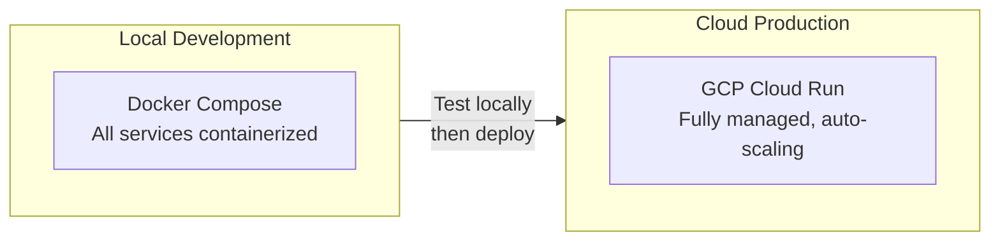
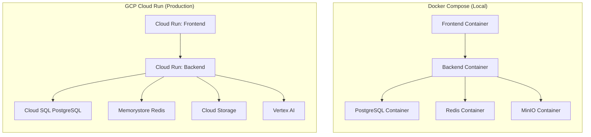
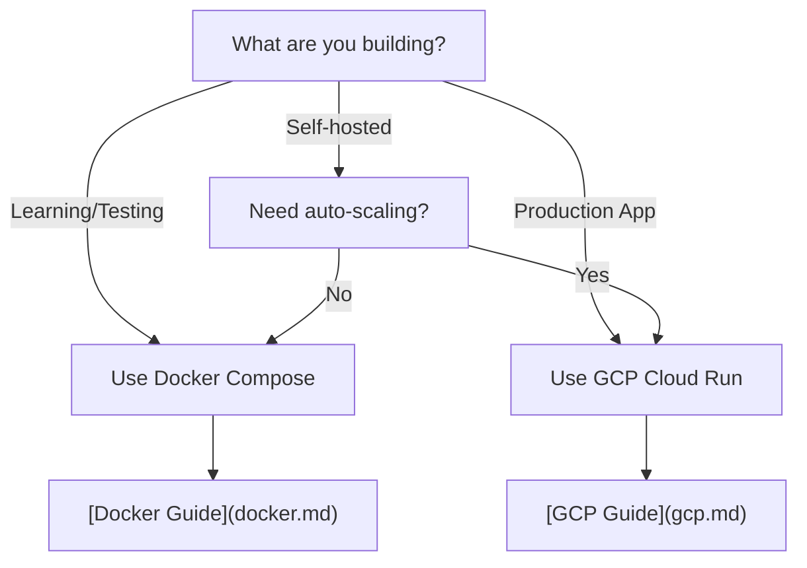
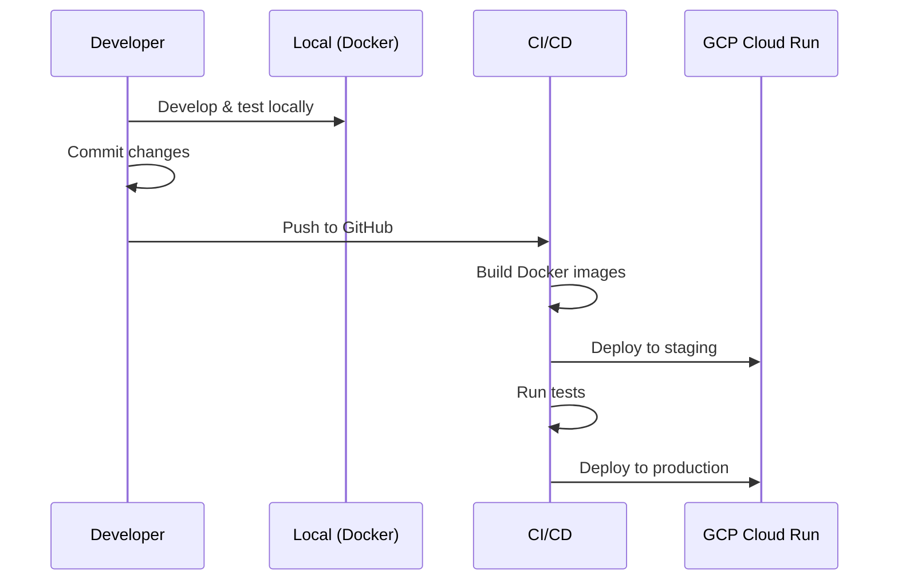

# Deployment

This section covers deploying AppArt Agent to various environments.

## Deployment Options



| Option | Best For | Complexity | Cost |
|--------|----------|------------|------|
| [Docker Compose](docker.md) | Local development, testing, self-hosted | Low | Free |
| [GCP Cloud Run](gcp.md) | Production, scalable, managed infrastructure | Medium | ~$50-315/month |
| [Infrastructure (Terraform)](infrastructure.md) | Infrastructure as Code reference | - | - |

## Architecture Comparison



## Environment Comparison

| Feature | Docker (Local) | GCP Cloud Run |
|---------|---------------|---------------|
| **Database** | PostgreSQL container | Cloud SQL (managed) |
| **Storage** | MinIO (S3-compatible) | Cloud Storage (GCS) |
| **Cache** | Redis container | Memorystore Redis |
| **AI Services** | Gemini API Key | Vertex AI (managed) |
| **SSL/TLS** | Self-signed (optional) | Managed certificates |
| **Scaling** | Manual | Automatic (0-N instances) |
| **Backups** | Manual | Automated daily |
| **Monitoring** | Docker logs | Cloud Monitoring + Logging |
| **Cost** | Free | ~$65-445/month |

## Quick Reference

### Docker Deployment

```bash
# Clone and configure
git clone https://github.com/benjamin-karaoglan/appart-agent.git
cd appart-agent
cp .env.example .env
# Add GOOGLE_CLOUD_API_KEY to .env

# Start all services
docker-compose up -d

# Run migrations
docker-compose exec backend alembic upgrade head

# Access
# Frontend: http://localhost:3000
# Backend:  http://localhost:8000
# MinIO:    http://localhost:9001
```

[Full Docker Guide →](docker.md)

### GCP Deployment

```bash
# Configure GCP
export PROJECT_ID="your-project-id"
export REGION="europe-west1"
gcloud config set project $PROJECT_ID

# Deploy with Terraform
cd infra/terraform
cp terraform.tfvars.example terraform.tfvars
# Edit terraform.tfvars

terraform init
terraform apply

# Build and deploy
docker build -t $REGION-docker.pkg.dev/$PROJECT_ID/appart-agent/backend:latest \
  --target production ./backend
docker push $REGION-docker.pkg.dev/$PROJECT_ID/appart-agent/backend:latest

gcloud run jobs execute db-migrate --region $REGION --wait
```

[Full GCP Guide →](gcp.md)

## Prerequisites

### Docker

- Docker Engine 20.10+
- Docker Compose v2
- 4GB+ RAM available
- 10GB+ disk space
- Google Cloud API key (for AI features)

### GCP

- GCP project with billing enabled
- gcloud CLI authenticated
- Terraform >= 1.5.0
- Docker (for building images)
- Domain name (optional, for custom domain)

## Choosing a Deployment Option



### Use Docker Compose when:

- Developing locally
- Running demos or testing
- Self-hosting on a single server
- Learning the system
- Budget is limited

### Use GCP Cloud Run when:

- Running in production
- Need automatic scaling
- Want managed infrastructure
- Need high availability
- Have compliance requirements
- Want custom domain with SSL

## Deployment Workflow



## Next Steps

- **New to AppArt Agent?** Start with [Docker Deployment](docker.md)
- **Ready for production?** Follow the [GCP Cloud Run Guide](gcp.md)
- **Want to test GCP locally?** See [Local Setup with GCS](../development/local-setup.md#google-cloud-storage-with-service-account-impersonation-recommended)
