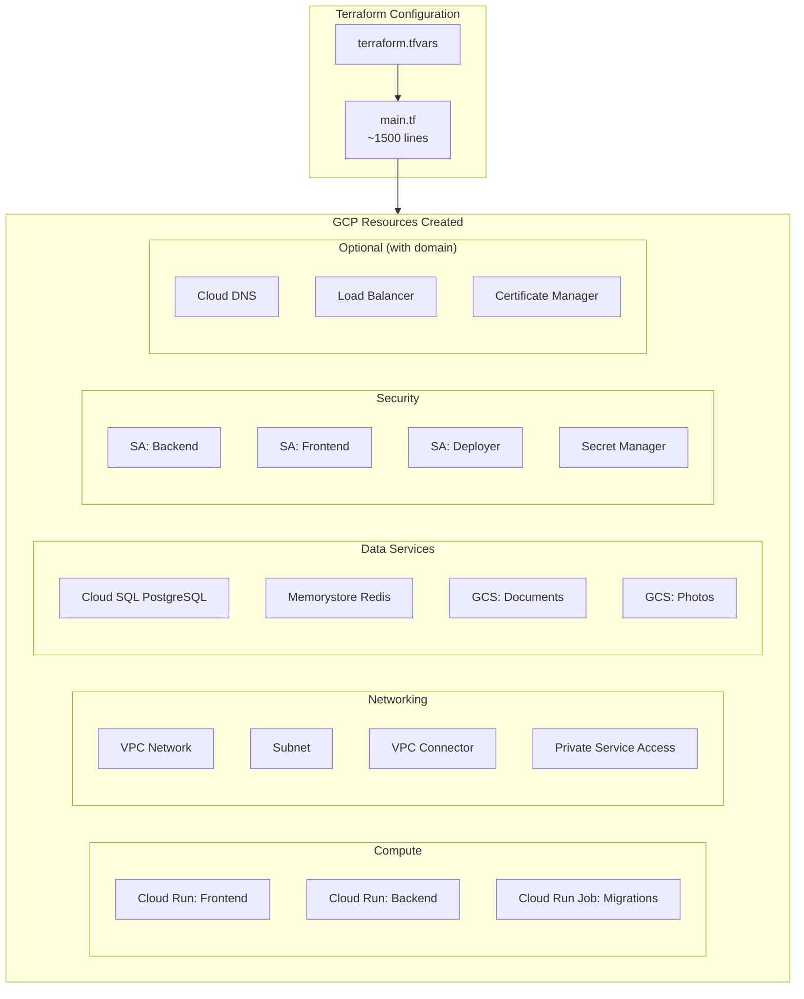
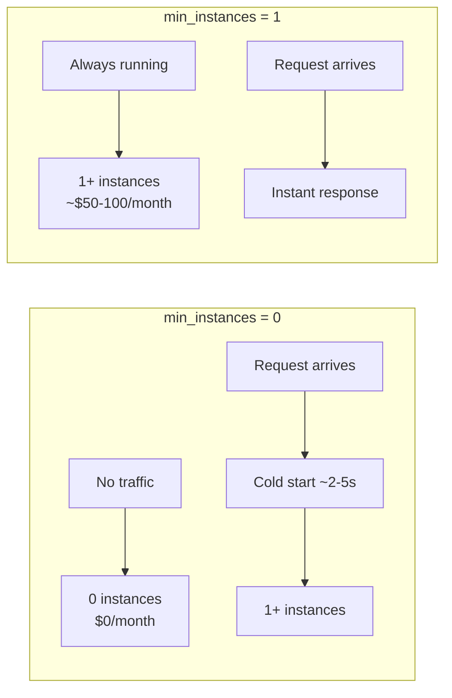
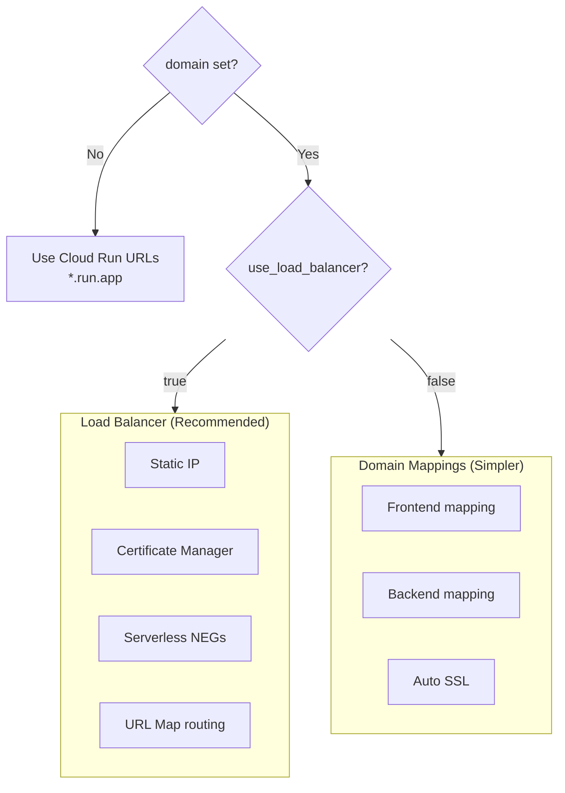
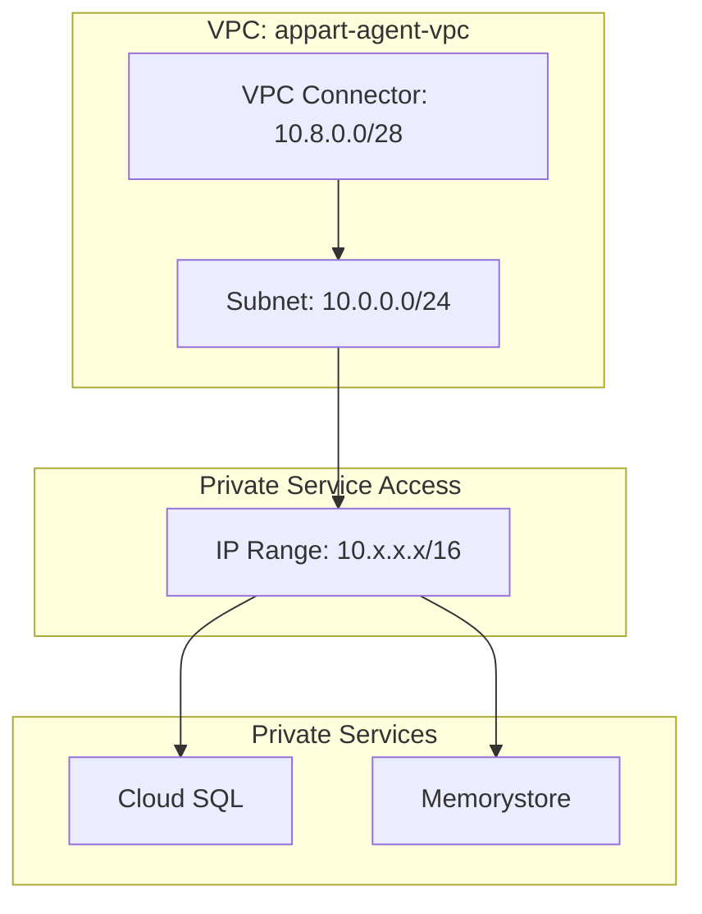
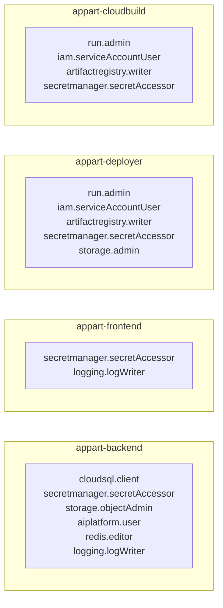
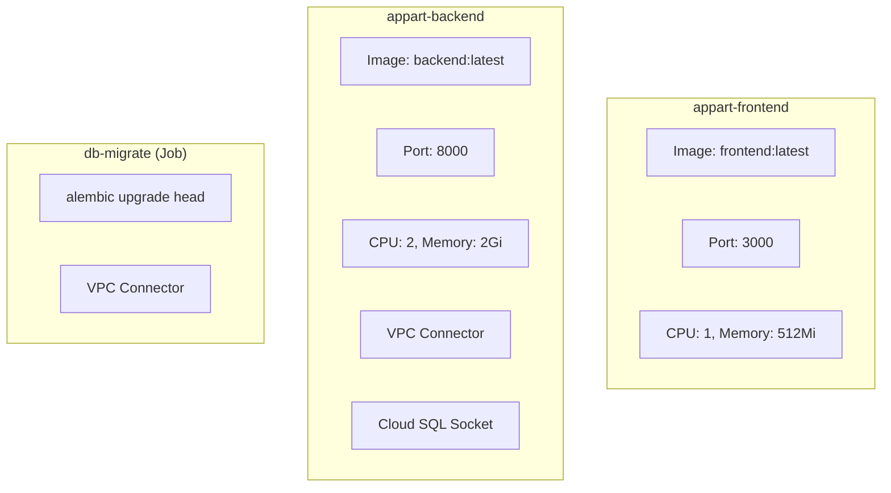
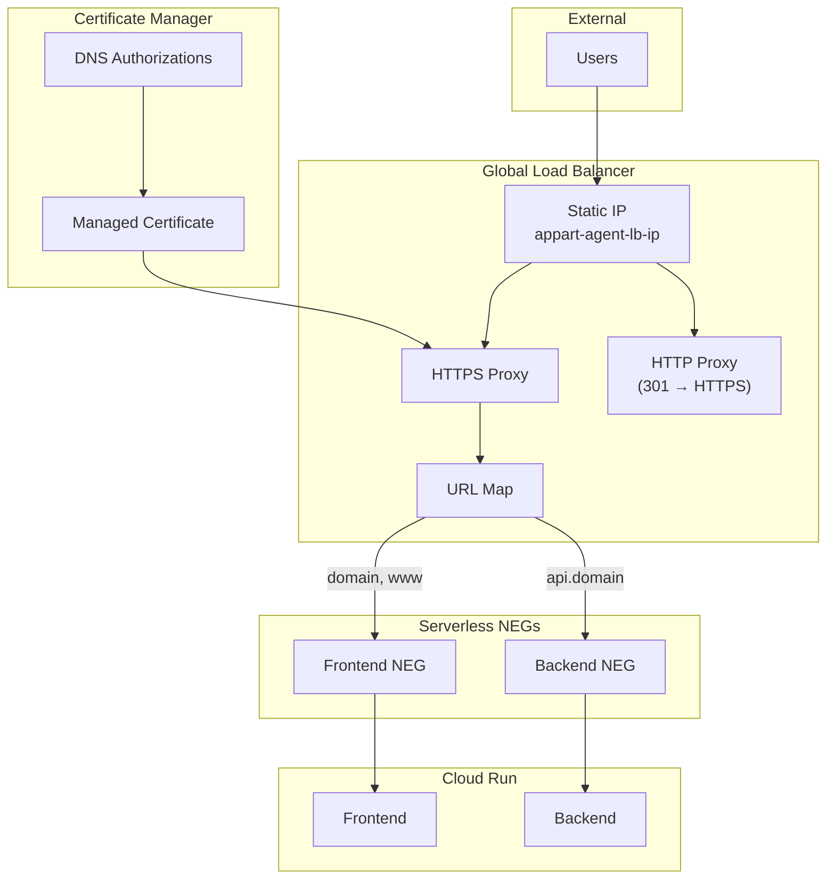

# Infrastructure as Code

This guide covers the Terraform configuration used to deploy AppArt Agent on Google Cloud Platform.

## Overview



## File Structure

```text
infra/
└── terraform/
    ├── main.tf                    # All Terraform resources (~1500 lines)
    └── terraform.tfvars.example   # Example configuration file
```

## Quick Start

```bash
cd infra/terraform

# Copy and configure variables
cp terraform.tfvars.example terraform.tfvars
# Edit terraform.tfvars with your project_id and settings

# Initialize Terraform
terraform init

# Preview changes
terraform plan

# Apply infrastructure
terraform apply

# View outputs
terraform output
```

## Variables Reference

### Required Variables

| Variable | Type | Description |
|----------|------|-------------|
| `project_id` | string | Your GCP project ID |

### Deployment Configuration

| Variable | Type | Default | Description |
|----------|------|---------|-------------|
| `region` | string | `europe-west1` | GCP region for all resources |
| `environment` | string | `production` | `staging` or `production` |

### Cloud Run Configuration

| Variable | Type | Default | Description |
|----------|------|---------|-------------|
| `min_instances` | number | `0` | Minimum instances (0=scale-to-zero, 1=always-on) |



### Database Configuration

| Variable | Type | Default | Description |
|----------|------|---------|-------------|
| `db_tier` | string | `db-f1-micro` | Cloud SQL instance tier |

**Available Tiers:**

| Tier | vCPU | RAM | Cost/month | Best For |
|------|------|-----|------------|----------|
| `db-f1-micro` | Shared | 614 MB | ~$10 | Development |
| `db-g1-small` | Shared | 1.7 GB | ~$25 | Staging |
| `db-custom-1-3840` | 1 | 3.75 GB | ~$40 | Small production |
| `db-custom-2-4096` | 2 | 4 GB | ~$70 | Production |
| `db-custom-4-8192` | 4 | 8 GB | ~$140 | High traffic |

### Redis Configuration

| Variable | Type | Default | Description |
|----------|------|---------|-------------|
| `redis_tier` | string | `BASIC` | `BASIC` or `STANDARD_HA` |
| `redis_memory_size_gb` | number | `1` | Memory size (1-300 GB) |

| Tier | Availability | Cost (1GB) | Best For |
|------|--------------|------------|----------|
| `BASIC` | Single zone | ~$35/month | Development, staging |
| `STANDARD_HA` | Multi-zone HA | ~$70/month | Production |

### Custom Domain Configuration

| Variable | Type | Default | Description |
|----------|------|---------|-------------|
| `domain` | string | `""` | Custom domain (e.g., `appartagent.com`) |
| `use_load_balancer` | bool | `true` | Use Cloud Load Balancer vs domain mappings |
| `create_dns_zone` | bool | `true` | Create Cloud DNS managed zone |
| `api_subdomain` | string | `api` | Subdomain for backend API |



### Observability

| Variable | Type | Default | Description |
|----------|------|---------|-------------|
| `logfire_token` | string | `""` | Logfire write token (optional) |

## Resources Created

### Networking



| Resource | Name | Purpose |
|----------|------|---------|
| VPC Network | `appart-agent-vpc` | Private networking |
| Subnet | `appart-agent-subnet` | `10.0.0.0/24` |
| VPC Connector | `appt-agent-connector` | Cloud Run → VPC access |
| Private IP Range | Dynamic | Cloud SQL & Redis private access |

### Service Accounts & IAM



| Service Account | Purpose | Key Permissions |
|-----------------|---------|-----------------|
| `appart-backend` | Backend Cloud Run service | SQL, Storage, AI, Redis |
| `appart-frontend` | Frontend Cloud Run service | Secrets, Logging |
| `appart-deployer` | GitHub Actions CI/CD | Run admin, AR writer |
| `appart-cloudbuild` | Cloud Build (if used) | Run admin, AR writer |

### Secret Manager

| Secret | Content | Set By |
|--------|---------|--------|
| `database-url` | PostgreSQL connection string | Terraform (auto) |
| `db-password` | Database password | Terraform (auto) |
| `jwt-secret` | Application secret key | Terraform (auto) |
| `better-auth-secret` | Better Auth session signing key | Manual or Terraform |
| `google-cloud-api-key` | Gemini API key | Manual (optional) |
| `logfire-token` | Logfire write token | Terraform or Manual |

### Cloud Run Services



| Service | CPU | Memory | Min Instances | Max Instances |
|---------|-----|--------|---------------|---------------|
| `appart-frontend` | 1 | 512Mi | `var.min_instances` | 10 |
| `appart-backend` | 2 | 2Gi | `var.min_instances` | 10 |
| `db-migrate` (job) | 1 | 1Gi | N/A | 1 |

### Storage Buckets

| Bucket | Name Pattern | Purpose | CORS |
|--------|--------------|---------|------|
| Documents | `{project_id}-documents` | PDF uploads, document storage | Enabled |
| Photos | `{project_id}-photos` | Photo uploads, redesigns | Enabled |

### Database

| Resource | Configuration |
|----------|---------------|
| Instance | `appart-agent-db` |
| Version | PostgreSQL 15 |
| Database | `appart_agent` |
| User | `appart` |
| Network | Private IP only (no public access) |
| Backups | Daily at 03:00, PITR in production |

### Load Balancer (Optional)

When `use_load_balancer = true` and `domain` is set:



## Outputs

After `terraform apply`, these outputs are available:

```bash
terraform output
```

| Output | Description |
|--------|-------------|
| `frontend_url` | Cloud Run frontend URL |
| `backend_url` | Cloud Run backend URL |
| `frontend_custom_url` | Custom domain frontend URL (if configured) |
| `backend_custom_url` | Custom domain API URL (if configured) |
| `database_instance` | Cloud SQL instance name |
| `redis_host` | Redis IP address |
| `documents_bucket` | Documents GCS bucket name |
| `photos_bucket` | Photos GCS bucket name |
| `artifact_registry` | Docker registry URL |
| `backend_service_account` | Backend SA email |
| `deployer_service_account` | Deployer SA email |
| `dns_nameservers` | Cloud DNS nameservers (if using Cloud DNS) |
| `lb_ip` | Load balancer IP (if using LB) |

## State Management

### Local State (Default)

State is stored locally in `terraform.tfstate`.

```bash
# State file location
infra/terraform/terraform.tfstate
```

### Remote State (Recommended for Teams)

For team environments, configure GCS backend:

```hcl
# Uncomment in main.tf
terraform {
  backend "gcs" {
    bucket = "your-project-tfstate"
    prefix = "terraform/state"
  }
}
```

Setup:

```bash
# Create state bucket
gsutil mb -l europe-west1 gs://your-project-tfstate

# Enable versioning
gsutil versioning set on gs://your-project-tfstate

# Initialize with remote backend
terraform init -migrate-state
```

## Common Operations

### Update Infrastructure

```bash
# Pull latest code
git pull

# Review changes
terraform plan

# Apply changes
terraform apply
```

### Scale Resources

```bash
# Edit terraform.tfvars
min_instances = 1        # Enable always-on
db_tier = "db-custom-2-4096"  # Upgrade database

# Apply
terraform apply
```

### Add Custom Domain

```bash
# Edit terraform.tfvars
domain = "yourdomain.com"
use_load_balancer = true
create_dns_zone = true

# Apply (this creates many resources)
terraform apply

# Get nameservers
terraform output dns_nameservers
# Update at your domain registrar
```

### Import Existing Resources

If resources were created manually:

```bash
# Import existing DNS zone
terraform import 'google_dns_managed_zone.main[0]' \
  projects/PROJECT_ID/managedZones/ZONE_NAME

# Import existing Artifact Registry
terraform import google_artifact_registry_repository.docker \
  projects/PROJECT_ID/locations/REGION/repositories/appart-agent

# Import existing secrets
terraform import 'google_secret_manager_secret.logfire_token' \
  projects/PROJECT_ID/secrets/logfire-token
```

### View Resource Details

```bash
# List all resources
terraform state list

# Show specific resource
terraform state show google_cloud_run_v2_service.backend

# Show all outputs
terraform output -json
```

## Destroy Infrastructure

```bash
# Preview destruction
terraform plan -destroy

# Destroy all resources
terraform destroy
```

!!! danger "Warning"
    This permanently deletes:

    - Cloud SQL database and all data
    - Redis cache
    - Storage buckets and all files
    - All Cloud Run services
    - Secrets and service accounts

### Partial Destruction

```bash
# Destroy only Cloud Run services
terraform destroy -target=google_cloud_run_v2_service.backend
terraform destroy -target=google_cloud_run_v2_service.frontend

# Destroy only load balancer
terraform destroy -target=google_compute_global_forwarding_rule.https
```

## Cost Estimation

### Development Setup

| Resource | Configuration | Cost/month |
|----------|---------------|------------|
| Cloud SQL | `db-f1-micro` | ~$10 |
| Redis | `BASIC` 1GB | ~$35 |
| Cloud Run | `min_instances=0` | ~$0-10 |
| Storage | ~10GB | ~$1 |
| **Total** | | **~$50/month** |

### Production Setup

| Resource | Configuration | Cost/month |
|----------|---------------|------------|
| Cloud SQL | `db-custom-2-4096` | ~$70 |
| Redis | `STANDARD_HA` 1GB | ~$70 |
| Cloud Run | `min_instances=1` | ~$100-150 |
| Load Balancer | Global LB | ~$20 |
| Storage | ~50GB | ~$5 |
| **Total** | | **~$265-315/month** |

## Troubleshooting

### Terraform Errors

**API not enabled:**

```bash
# Enable required API
gcloud services enable SERVICE_NAME.googleapis.com
```

**Permission denied:**

```bash
# Check current user
gcloud auth list

# Ensure correct project
gcloud config set project YOUR_PROJECT_ID
```

**Resource already exists:**

```bash
# Import the resource
terraform import RESOURCE_ADDRESS RESOURCE_ID
```

### State Issues

**State lock:**

```bash
# Force unlock (use carefully)
terraform force-unlock LOCK_ID
```

**State out of sync:**

```bash
# Refresh state from GCP
terraform refresh
```

## Security Best Practices

1. **State file security** - Use remote backend with encryption
2. **Sensitive variables** - Use `sensitive = true` for secrets
3. **Least privilege** - Service accounts have minimal permissions
4. **Private networking** - Database and Redis use private IPs only
5. **Secrets in Secret Manager** - No secrets in Terraform variables

## Next Steps

- [GCP Deployment Guide](gcp.md) - Full deployment walkthrough
- [Docker Deployment](docker.md) - Local development setup
- [Local Setup with GCP](../development/local-setup.md#google-cloud-storage-with-service-account-impersonation-recommended) - Test with real GCP services locally
