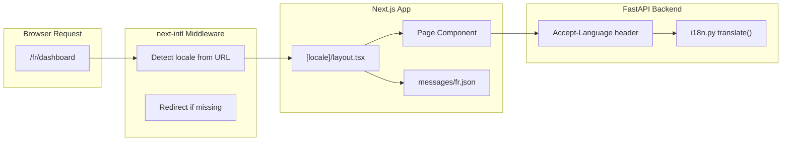

# Internationalization (i18n)

AppArt Agent supports French and English via [next-intl](https://next-intl-docs.vercel.app/). The locale is reflected in the URL path (`/fr/dashboard`, `/en/dashboard`).

## Architecture



## Frontend

### File Structure

```text
frontend/
├── messages/
│   ├── en.json              # English translations
│   └── fr.json              # French translations
├── src/
│   ├── i18n/
│   │   ├── config.ts        # Locale list and default locale
│   │   ├── navigation.ts    # Locale-aware Link, useRouter, etc.
│   │   └── routing.ts       # Routing config (prefix strategy)
│   ├── middleware.ts         # next-intl middleware (locale detection)
│   └── app/
│       └── [locale]/         # All pages are under [locale] segment
│           ├── layout.tsx
│           ├── page.tsx
│           ├── dashboard/
│           └── ...
```

### Configuration

**`src/i18n/config.ts`** defines the supported locales:

```typescript
export const locales = ['fr', 'en'] as const;
export const defaultLocale = 'fr';
```

**`src/i18n/routing.ts`** configures the routing strategy:

```typescript
export const routing = defineRouting({
  locales,
  defaultLocale,
  localePrefix: 'always',     // Always show /fr/ or /en/ in the URL
  localeDetection: true,       // Auto-detect from browser Accept-Language
});
```

**`src/middleware.ts`** intercepts requests and adds the locale prefix:

```typescript
import createMiddleware from 'next-intl/middleware';
import { routing } from './i18n/routing';

export default createMiddleware(routing);

export const config = {
  matcher: ['/((?!api|_next|.*\\..*).*)'],  // Skip API routes and static files
};
```

### Using Translations in Components

```tsx
import { useTranslations } from 'next-intl';

export default function Dashboard() {
  const t = useTranslations('dashboard');

  return <h1>{t('welcome', { name: user.name })}</h1>;
  // EN: "Welcome back, John!"
  // FR: "Bon retour, John !"
}
```

### Translation Files

Translation files are in `frontend/messages/`. Each file is a flat JSON object organized by page/component namespace:

```json
{
  "header": {
    "dashboard": "Tableau de bord",
    "properties": "Biens",
    "logout": "Déconnexion"
  },
  "dashboard": {
    "welcome": "Bon retour, {name} !",
    "stats": {
      "totalProperties": "Total des biens"
    }
  }
}
```

### Locale-Aware Navigation

Use the locale-aware `Link` and `useRouter` from `@/i18n/navigation` instead of the standard Next.js imports:

```tsx
import { Link, useRouter } from '@/i18n/navigation';

// Link automatically includes the current locale in the URL
<Link href="/dashboard">Dashboard</Link>
// Renders: /fr/dashboard or /en/dashboard

// useRouter.replace switches locale without losing the current path
const router = useRouter();
router.replace(pathname, { locale: 'en' });
```

### Locale Switcher

The `Header` component includes a locale toggle button that calls `router.replace()` with the alternate locale. The button has a fixed `min-w` to prevent layout shifts between locales.

## Backend

The backend uses the `Accept-Language` header to determine the response language.

### File: `backend/app/core/i18n.py`

```python
from app.core.i18n import get_local, translate, get_output_language

# In an API route:
locale = get_local(request)               # "fr" or "en" from Accept-Language
message = translate("email_already_registered", locale)  # Translated error message
output_lang = get_output_language(locale)  # "French" or "English" (for AI prompts)
```

- **`get_local(request)`** — extracts locale from the `Accept-Language` header
- **`translate(key, locale)`** — looks up a translation string from the `MESSAGES` dict
- **`get_output_language(locale)`** — returns `"French"` or `"English"` for use in AI prompt templates

### AI Prompt Language

AI prompt templates accept an `{output_language}` variable that controls the language of AI-generated responses:

```python
from app.prompts import get_prompt

prompt = get_prompt("dp_process_pv_ag", filename="pv.pdf", output_language="French")
```

This ensures document analysis results, recommendations, and summaries are returned in the user's language.

## Adding a New Translation Key

1. Add the key to both `messages/en.json` and `messages/fr.json`
2. Use it in your component with `useTranslations('namespace')`
3. If the key is used in backend error messages, also add it to `MESSAGES` in `backend/app/core/i18n.py`
